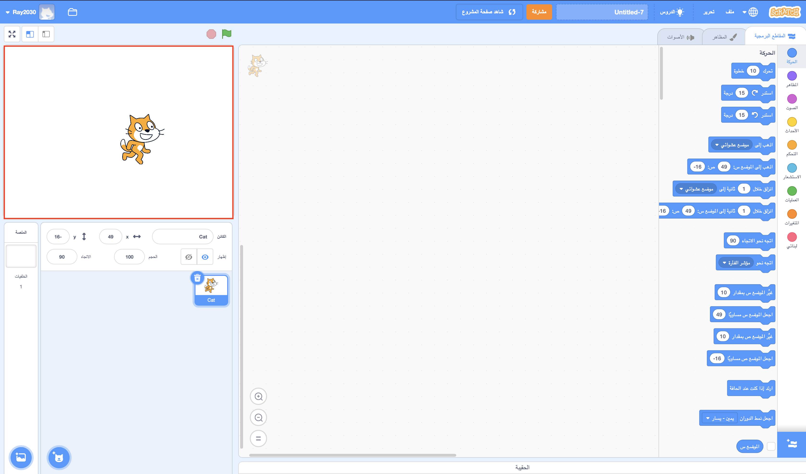
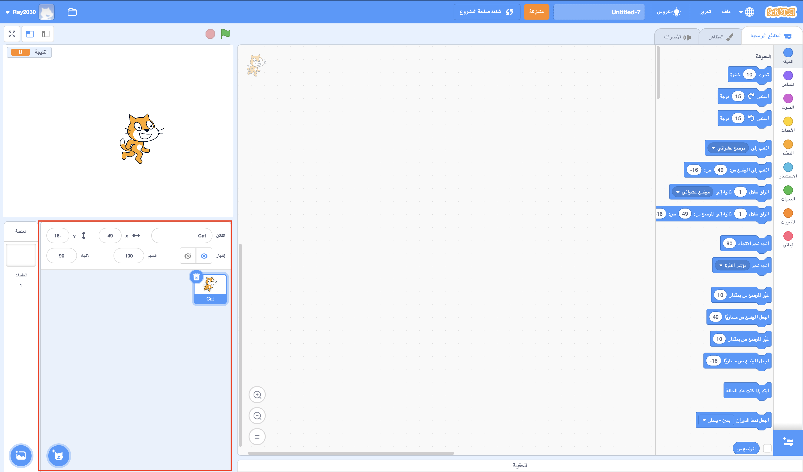
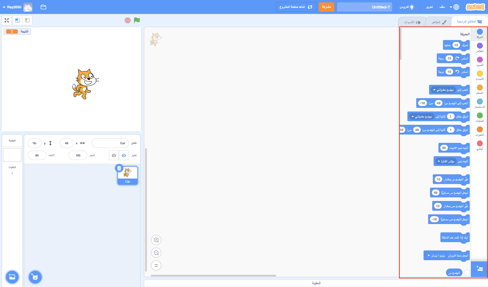
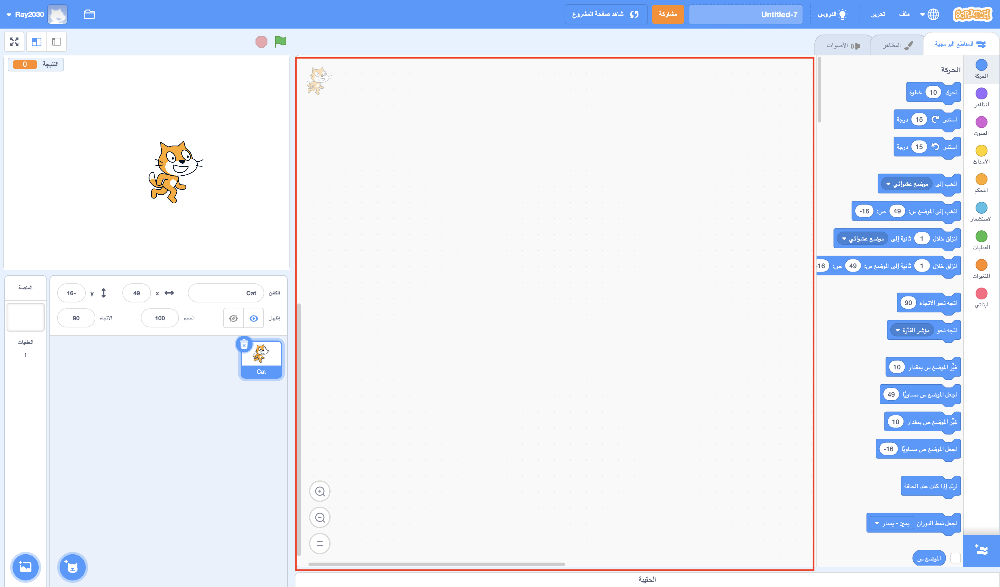
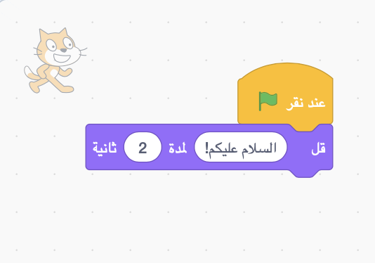

## هيا بنا لنبدأ

بمجرد فتح Scratch ، سترى نافذة مثل النافذة أدناه.

\--- task \---

انظر إلى كل من المساحات التالية وتذكر أين هم.

\---/task--

### المنصة



## \--- collapse \---

## title: ما هي المنصة؟

هذا هو المكان الذي يتم فيه تشغيل برامج Scratch. فيها:

* **خلفيات** واحد أو أكثر \ (صور على خلفية الشاشة \)

* أي **مقاطع برمجية** متعلقة بها \ (سوف نتكلم عن هذا \)

\--- /collapse \---

### قائمة الكائنات



## \--- collapse \---

## العنوان: ما هو الكائن؟

أي عنصر يمكنك إضافته على المنصة هو **كائن**.

الكائن يشمل:

* ** الصورة ** على المنصة
* أي **مظاهر** إضافية \ (اشكال \) لديه
* أي **أصوات** متعلقة به
* أي **مقاطع برمجية** متعلقة به 

\--- /collapse \---

### لوحة المقاطع البرمجية



## \--- collapse \---

## title: المقاطع البرمجية

تأتي التعليمات البرمجية في Scratch في شكل مقاطع تصلها ببعض لإنشاء البرامج. تختار مقاطع من **لوحة المقاطع البرمجية**، تسحبهم إلى ** لوحة الكائن الحالي**، ومن ثم تربطهم مع بعضهم البعض.

هناك عشر فئات من المقاطع. يتم ترميزها بالألوان ، ويمكنك الاختيار بينها من خلال النقر فوق العناصر الموجودة في القائمة أعلى **لوحة المقاطع البرمجية**.

\--- /collapse \---

### لوحة الكائن الحالي



## \--- /collapse \---

## title: ما هو الكائن الحالي؟

**الكائن الحالي** هو الذي تم إختياره من **قائمة الكائنات**.

لوحة **الكائن الحالي** هي المكان الذي يمكنك من خلاله رؤية البرمجة والمظاهر والأصوات الخاصة بالكائن الذي تم إختياره.

\--- /collapse \---

حان وقت البرمجة!

\--- task \---

في قائمة الكائنات، انقر فوق قطة Scratch. القطة هي الآن الكائن الحالي.

اختر فئة **الأحداث** في لوحة المقاطع البرمجية ، وانقر فوق `عند نقر العلم`{: class = "block3events"} ، واسحبه إلى لوحة الكائن الحالي.

```blocks3
    عند النقر فوق العلم الأخضر
```

\--- /task \---

\--- task \---

ثم انتقل إلى **المظاهر** في لوحة المقاطع البرمجية وابحث عن هذا المقطع:

```blocks3
    قل [السلام عليكم!] لمدة (2) ثوانٍ
```

انقر فوقه ، استمر في الضغط على زر الماوس ، ثم اسحبه إلى لوحة الكائن الحالي واترك الزر.

\--- /task \---

\--- task \---

الآن بعد أن أصبح المقطع الثانية في لوحة الكائن الحالي، قم بتوصيله أسفل المقطع الأول بالنقر عليها وسحبه مرة أخرى لتحريكه إلى أسفل المقطع الأخر حتى يتم ربطهم معًا ، كهذا:



\--- /task \---

\--- task \---

الآن انقر فوق زر **انطلق** وشاهد ما سيحدث!

\--- /task \---