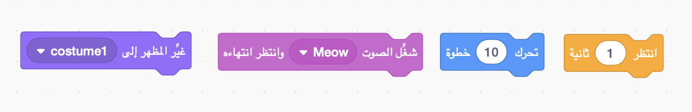
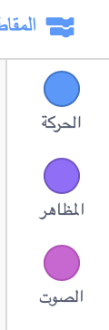
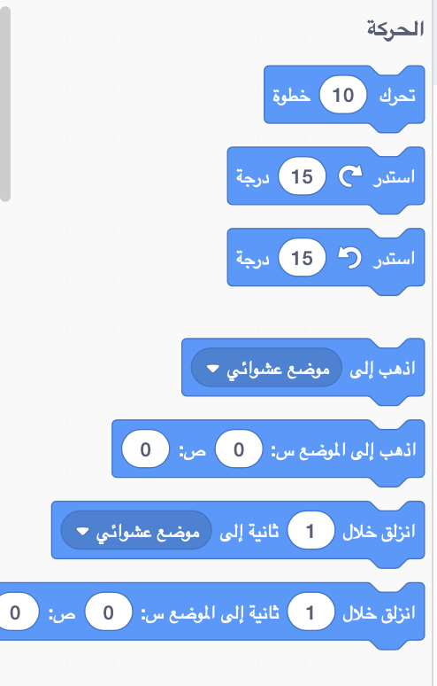
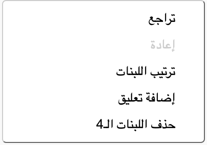

## إضافة وإزالة المقاطع البرمجية

عظيم! لقد كتبت أول برنامج Scratch لك. حان الوقت لمعرفة المزيد حول إدخال و إزالة الكود من Scratch! تتكون برمجة Scratch من **مقاطع** كهذه:



سوف تجد جميع المقاطع في **لوحة المقاطع البرمجية **، ويتم تصنيفها إلى فئات مختلفة وفقا لعملهم.

## \--- collapse \---

## title: استخدام مقاطع من مختلف الفئات

انقر على اسم الفئة لرؤية المقاطع التي تحتويها. هنا ، تم تحديد فئة **الحركة**:



جميع المقاطع في الفئة التي نقرت عليها معروضة في قائمة:



يمكنك النقر فوق المقطع الذي تريده ، ثم قم بسحبه إلى لوحة الكائن الحالي واتركه. بمجرد وجوده في اللوحة ، يمكنك تحريكه وتوصيله بالمقاطع الأخرى.

\--- /collapse \---

إذا كنت تريد أن ترى ما يقوم به مقطع ما ، فيمكنك النقر مرتين عليه لتشغيله!

\--- task \--- حاول النقر نمرتين على بعض المقاطع لترى ما يفعلونه. \--- /task \---

## \--- collapse \---

## title: تشغيل الكود

عادة ، تريد تشغيل الكود تلقائيًا كلما حدث شيء معين. هذا هو السبب في أن العديد من برامجك ستبدأ بمقطع من فئة **الأحداث**، غالبًا هذا المقطع:

```blocks3
    عند نقر العلم الأخضر
```

المقاطع البرمجية المتصلة بهذا المقطع سوف تعمل بعد نقر **العلم الأخضر**.

يتم تشغيل المقاطع البرمجية من الأعلى إلى الأسفل ، لذا فإن الترتيب الذي تصل فيه المقاطع معًا أمر مهم. في هذا المثال, سيقوم الكائن `بقول`{:class="block3looks"} `السلام عليكم!` قبل ان `يشغل`{:class="block3sound"} صوت `meow`.

```blocks3
    عندما نقر العلم الأخضر
    قل [Hello]
    شغل صوت [meow v]
```

\--- /collapse \---

من السهل إزالة أو حذف المقاطع البرمجية التي لا تريدها في البرنامج! فقط اسحبهم مرة أخرى إلى لوحة المقاطع البرمجية.

**انتبه:** سحبهم إلى لوحة المقاطع البرمجية سيحذف جميع المقاطع المتصلة بالمقطع الذي سحبته, لذا تأكد من فصل المقاطع التي تريد حذفها من المقاطع التي تريد الإبقاء عليها. إذا قمت بحذف بعض التعليمات البرمجية عن طريق الخطأ وتريد استعادتها ، انقر بزر الماوس الأيمن ثم انقر فوق الخيار **تراجع** لاستعادة كل شيء.



\--- task \--- حاول إضافة وحذف وإستعادة بعض المقاطع البرمجية! \--- /task \---

### ضع كل شيء معا

Now you know how to move code around and make things happen, it's time for you to create a program to make the Scratch Cat walk in a circle!

\--- task \--- Make sure you have the cat sprite selected in the sprite list, and then drag the following blocks into the sprite panel and connect them. You’ll find them in the **Events** and **Motion** lists.

```blocks3
    when green flag clicked
    move [10] steps
```

\--- /task \---

\--- task \--- Now, click on the green flag above the Stage.

 \--- /task \---

You should see the cat walking in a straight line...not exactly what you want, right?

Note: If you click th flag too many times and the cat walks away, you can drag it back!

\--- task \--- Snap the turn block to the end to make the cat sprite walk in a circle. It’s in the **Motion** list too.

```blocks3
    when green flag clicked
    move [10] steps
+    turn cw (15) degrees
```

\--- /task \---

## \--- collapse \---

## title: How does turning work?

This block makes the sprite turn 15 degrees of the full 360 degrees that make up a circle. You can change that number, and the number of steps, by clicking on the number and typing in a new value.


\--- /collapse \---

\--- task \--- Now save your work! \--- /task \---