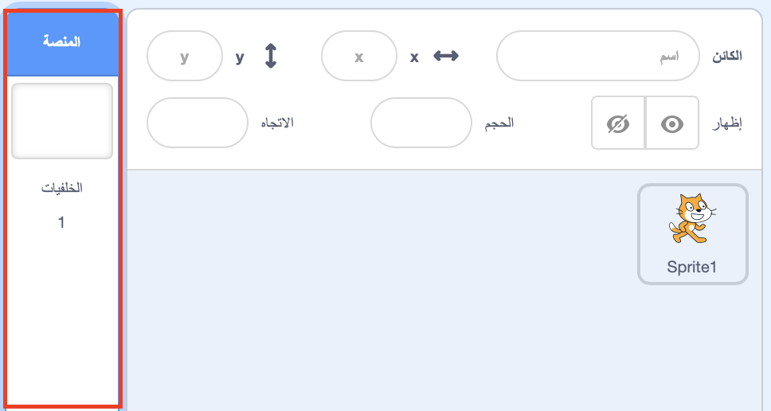
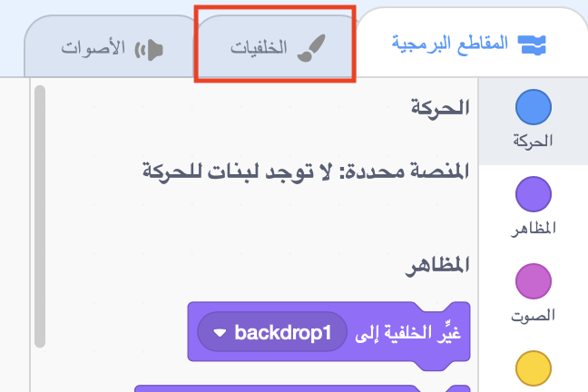
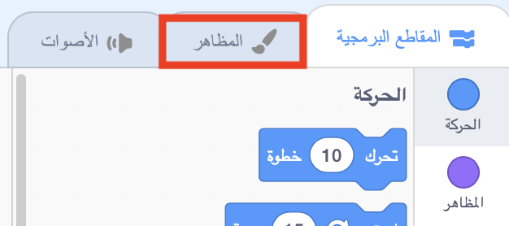

## إعداد المشهد

يحتوي Scratch على مكتبة من الخلفيات والكائنات يمكنك استخدامها لجعل مشروعك رائعًا.

\--- task \--- اختر المنصة.

انقر على ** الخلفيات **.

إضغط على ايقونة **اختيار خلفية من المكتبة**.

ثم اختر الخلفية المفضلة لديك تحت الماء!

 \--- /task \---

عظيم! بالطبع ، لديك الآن قطة تحت الماء ، والقطط ليست من المعجبين بهذا الأمر. ولكن يمكنك إصلاح ذلك ، لأنه يمكنك تحويل القط إلى سمكة قرش!

\--- task \--- أولاً ، حدد كائن القط وانقر على تبويب **المظاهر**.

ثم ، انقر فوق ** اختيار مظهر من المكتبة **

حدد صورة القرش هذه وانقر فوق **موافق**.

الآن قم بإزالة أزياء القط عن طريق تحديد كل منها والنقر على ** x **.

 \--- /task \---

الآن لديك سمكة قرش - ممتازة!