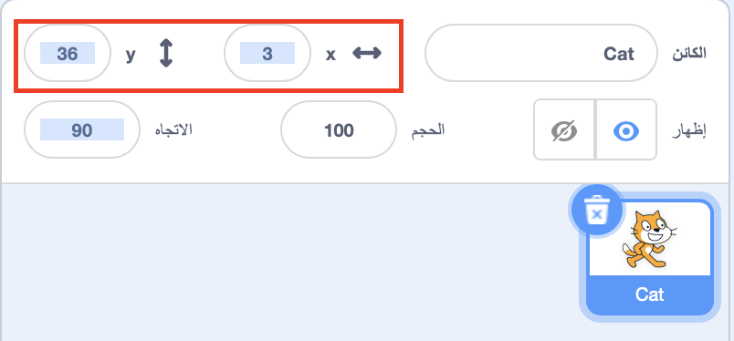

## تحريك الأشياء في جميع الأنحاء

الآن يتحرك القرش في دائرة ، وسيكون من الممتع اكثر ان نتحكم به باستخدام مفاتيح الأسهم. على هذه البطاقة ، سوف تتعلم كيفية القيام بذلك!

--- task ---

ابدأ بحذف جميع المقاطع البرمجية التي لديك للقرش.

---/task ---

كما قد تكون خمنت على الأرجح ، ستحتاج إلى مقاطع الأحداث و الحركة مرة أخرى!

--- task ---

هذه المرة ، ابحث عن هذه الكتلة و اسحبها إلى لوحة الكائن الحالي:

```blocks3
    when [space v] key pressed
```

انقر على السهم الصغير (▼) بجانب `المسافة `. سترى قائمة بجميع مفاتيح لوحة المفاتيح التي يمكنك الاختيار منها.

--- /task ---

ستحتاج إلى أربعة من مقاطع `عند الضغط على المفتاح`{:class="block3events"} - واحدة لكل مفتاح من مفاتيح الأسهم الخاصة بك.

--- task ---

لتحريك سمك القرش ، قم بتوصيل هذه المقاطع بمقاطع الحركة هكذا:

```blocks3
    when [left arrow v] key pressed
    move (-10) steps
```

```blocks3
    when [right arrow v] key pressed
    move (10) steps
```

```blocks3
    when [up arrow v] key pressed
```

```blocks3
    when [down arrow v] key pressed
```

--- /task ---

 ملاحظة: ` -10 ` يعني "العودة 10 خطوات".

--- task ---

الآن انقر على العلم الأخضر لاختبار التعليمات البرمجية الخاصة بك.

--- /task ---

يتحرك سمك القرش الآن للخلف وللأمام ، وهو أمر رائع ، لكنه لا يتحرك للأعلى أو للأسفل. أيضًا ، إذا نظرت إلى مقاطع  الحركة  ، سترى أنه لا توجد مقاطع لـ "أعلى" أو "لأسفل". هناك مجموعة كاملة منها مرتبطة بـاحداثيات  س  و  ص  رغم ذلك - دعنا نجرب هؤلاء!

--- task ---

اسحب اثنين `غير الموضع ص بمقدار`{:class="block3motion"} ، وحدث البرمجة الخاص بك هكذا:

```blocks3
    when [up arrow v] key pressed
+     change y by (10)
```

```blocks3
    when [down arrow v] key pressed
+     change y by (-10)
```

--- /task ---

الآن عند الضغط على مفاتيح الأسهم ، يتحرك القرش في جميع أنحاء المنصة!

--- collapse ---
---
title: كيف تعمل إحداثيات س و ص؟
---

للحديث عن مواضع الاشياء ، مثل الكائنات ، نستخدم إحداثيات س و ص. يمتد نظام الإحداثيات في المنصة للمحور س  من اليسار إلى اليمين ، والمحور  ص يمتد من الأسفل إلى الأعلى.


يمكن تحديد موقع الكائن من احداثيات منتصفها, على سبيل المثال `(15, -27)`, حيث ان `15` هو موضعه في المحور السيني, و `-27` هو موضعه في المحور الصادي.

+ للتعرف على كيفية عمل ذلك بالفعل ، حدد كائن واستخدم ضوابط س و ص لتحريكه حول المنصة من خلال تحديد قيم مختلفة للإحداثيات.



+ حاول بأزواج مختلفة من القيم لمعرفة أين يذهب الكائن! في Scratch ، يمتد المحور س من ` -240 ` إلى ` 240 ` ، ويمتد المحور ص من ` -180 ` إلى ` 180 `.

--- /collapse ---

### إعادة تشغيل اللعبة

يتحرك سمك القرش الآن على الشاشة ، لكن تخيل أنها لعبة: كيف تعيد تشغيلها ، وماذا يحدث في بداية كل لعبة؟

تحتاج إلى وصول القرش إلى موقعه الأولي عندما يبدأ اللاعب اللعبة. سيبدأون هذه اللعبة من خلال النقر على العلم الأخضر ، لذلك تحتاج إلى تغيير إحداثيات س و ص لكائن سمك القرش عند حدوث ذلك.

هذا في الواقع سهل جدا! مركز المنصة هو ` (0 ، 0) ` في إحداثيات `(س ، ص)`.

كل ما تحتاجه هو مقطع الأحداث لهذا العلم الأخضر ، و مقطع اذهب إلى الموضع من  الحركة .

--- task ---

اسحب مقطع `عند نقر العلم الأخضر`{:class="block3events"} من الاحداث إلى لوحة الكائن الحالي.

```blocks3
    when green flag clicked
```

ثم ابحث عن مقطع `اذهب إلى الموضع`{:class="block3motion"} في الحركة, والصقه بمقطع العلم من الأحداث.

```blocks3
    when green flag clicked
+     go to x: (0) y: (0)
```

اضبط كلا الإحداثيات `س` و `ص` إلى `0` في مقطع `اذهب إلى الموضع`{:class="block3motion"} اذا لم يكونا `0`.

--- /task ---

--- task ---

الآن انقر على العلم الأخضر: يجب أن ترى القرش يعود إلى وسط المنصة!

--- /task ---