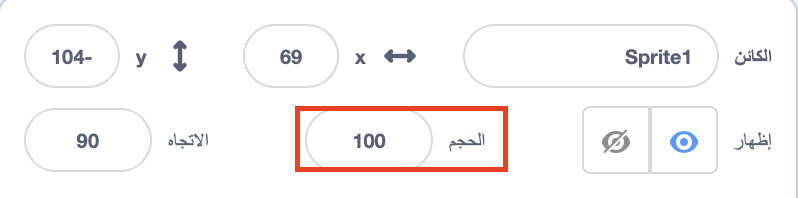
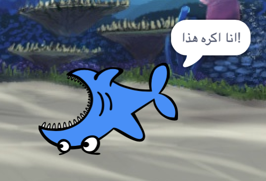

## كل الكائنات

الآن لديك سمكة قرش يمكنها التنقل باستخدام مفاتيح الأسهم. رائع! حان الوقت لإضافة بعض الأسماك ليصطادها.

--- task ---

انقر فوق زر **كائن جديد**، وعلى الشاشة التي تفتح ، اختر سمكة.


إذا كانت أسماكك كبيرة بعض الشيء مقارنة بسمك القرش الخاص بك، فيمكنك استخدام التحكم في الحجم لجعل كل الكائنات بالحجم المناسب!



غير الرقم في خانة الحجم لجعل الكائن أكبر أو أصغر.

--- /task ---

عظيم! في وقت لاحق ، ستقوم بإضافة بعض التعليمات البرمجية لجعل الأسماك تتحرك من تلقاء نفسها ، دون مساعدة من اللاعب. سيحرك اللاعب القرش ويحاول أن يصطاد السمك.

--- collapse ---
---
title: وماذا عن القرش المعكوس؟
---

يبدو الأمر مضحكا بعض الشيء أن يكون هذا القرش يسبح للوراء. تمامًا كما أنت في العادة تستدير بدلا من ان تمشي للخلف ، فإن القرش يستدير بدلا من السباحة للخلف. لحسن الحظ ، Scratch لديه مقطع لهذا!

يتيح لك مقطع `اتجه نحو الاتجاه`{:class="block3motion"} اختيار الاتجاه الذي يشير إليه الكائن. ستجده في قسم مقاطع **الحركة**. يمكنك كتابة أي مقدار من الدرجات ، لتوجيه الكائن أينما تريد.

--- collapse ---

--- task ---

احصل على نسختين من مقطع `اتجه نحو الاتجاه` {: class="block3motion"} من قائمة **الحركة **واربطهم ببرمجة القرش ، هكذا:

```blocks3
    when [left arrow v] key pressed
+     point in direction (-90)
    move (10) steps
```

```blocks3
    when [right arrow v] key pressed
+     point in direction (90)
    move (10) steps
```

--- /task ---

--- task ---

تغيير عدد الخطوات في مقاطع `التحريك`{:class="block3motion"} من ` -10 ` إلى ` 10 `.

إذا حاولت تحريك القرش الآن بعد إضافة مقاطع `اتجه نحو الاتجاه `{:class="block3motion"}، قد تلاحظ حدوث شيء غريب بعض الشيء. قد لا يستدير القرش بطريقة صحيحة تمامًا!



--- /task ---

--- collapse ---
---
title: لماذا ينقلب رأسا على عقب؟
---

المشكلة هنا هي أن كائن القرش بدأ ، كما هو الحال عند كل الكائنات ، باستخدام **نمط الدوران** "في جميع الاتجاهات" وما تحتاج إليه هو نمط "اليمين إلى اليسار".

كالعادة ، هناك مقطع لذلك ، وهو موجود في** الحركة**!

--- /collapse ---

--- task ---

ابحث في فئة **الحركة** على مقطع ` اجعل نمط الدوران `{:class="block3motion"}.

أضف المقطع إلى برمجة إعادة التعيين لسمك القرش من السابق ، واضبط نمط الدوران على `يمين-يسار`{:class="block3motion"} ، هكذا:

```blocks3
    when green flag clicked
+     set rotation style [left-right v]
    go to x: (0) y: (0)
```

--- /task ---