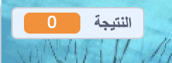

## حفظ النتيجة

للحفاظ على عدد الأسماك التي يصطادها اللاعب ، ستحتاج إلى مكان لتخزين النتيجة ، وطريقة إضافتها ، وطريقة لإعادة ضبطها عند إعادة تشغيل اللعبة.

أولاً: تخزين النتيجة!

\--- task \--- انتقل إلى فئة مقاطع ** المتغيرات ** وانقر على ** إنشاء متغير **.


أدخل ` النتيجة ` كاسم.


تحقق من المتغير الجديد الخاص بك!

 \--- /task \---

## \--- collapse \---

## title: ما هي المتغيرات؟

عندما تريد تخزين المعلومات في برنامج ما ، فأنت تستخدم شيئًا يسمى ** المتغير**. فكر في الأمر كأنه صندوق له اسم: يمكنك وضع شيء فيه ، والتحقق من محتواه ، وتغيير محتواه. ستجد المتغيرات في قسم ** المتغيرات **، ولكن عليك إنشاءها أولاً حتى تظهر هناك!

\--- /collapse \---

الآن تحتاج إلى تحديث المتغير كلما أكل سمك القرش سمكة ، وإعادة تعيينه عند إعادة تشغيل اللعبة. القيام بالأمرين سهل للغاية:

\--- task \--- From the **Variables** section, take the `set [my variable v] to [0]`{:class="block3variables"} and `change [my variable v] by [1]`{:class="block3variables"} blocks. Click on the little arrows in the blocks, choose `score` from the list, and then put the blocks into your program:

### Code for the shark

```blocks3
    when green flag clicked
+    set [score v] to [0]
    set rotation style [left-right v]
    go to x: (0) y: (0)
```

### Code for the fish

```blocks3
    if <touching [Sprite1 v] ?> then
+        change [score v] by [1]
        hide
        wait (1) secs
        go to x: (pick random (-240) to (240)) y: (pick random (-180) to (180))
        show
    end
```

\--- /task \---

Cool! Now you’ve got a score and everything.