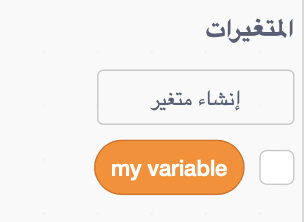
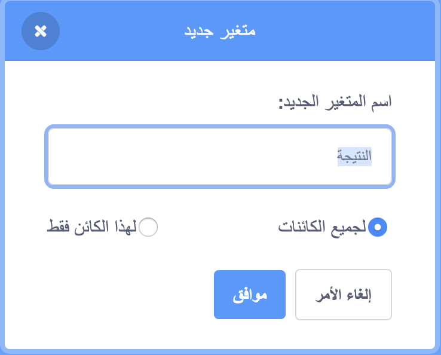

## حفظ النتيجة

للحفاظ على عدد الأسماك التي يصطادها اللاعب ، ستحتاج إلى مكان لتخزين النتيجة ، وطريقة إضافتها ، وطريقة لإعادة ضبطها عند إعادة تشغيل اللعبة.

أولاً: تخزين النتيجة!

--- task ---

انتقل إلى فئة مقاطع المتغيرات وانقر على إنشاء متغير.



أدخل `النتيجة` كأسم.



تحقق من المتغير الجديد الخاص بك!


--- /task ---

--- collapse ---
---
title: ما هي المتغيرات؟
---

عندما تريد تخزين المعلومات في برنامج ما ، فأنت تستخدم شيئًا يسمى المتغير. فكر في الأمر كأنه صندوق له اسم: يمكنك وضع شيء فيه ، والتحقق من محتواه ، وتغيير محتواه. ستجد المتغيرات في قسم المتغيرات، ولكن عليك إنشاءها أولاً حتى تظهر هناك!

--- /collapse ---

الآن تحتاج إلى تحديث المتغير كلما أكل سمك القرش سمكة ، وإعادة تعيينه عند إعادة تشغيل اللعبة. القيام بالأمرين سهل للغاية:

--- task ---

من قسم المتغيرات، خذ المقاطع `اجعل [متغيري v] مساوياً [0]`{:class="block3variables"} و `غير [متغيري v] بمقدار [1]`{:class="block3variables"}. انقر على الأسهم الصغيرة في المقاطع ، واختر ` النتيجة ` من القائمة ، ثم ضع المقاطع في برنامجك:

### بزمجة سمكة القرش

```blocks3
    when green flag clicked
+    set [النتيجة v] to [0]
    set rotation style [left-right v]
    go to x: (0) y: (0)
```

### برمجة السمكة

```blocks3
    if <touching [Sprite1 v] ?> then
+        change [النتيجة v] by [1]
        hide
        wait (1) secs
        go to x: (pick random (-240) to (240)) y: (pick random (-180) to (180))
        show
    end
```

--- /task ---

رائع! الآن لديك نتيجة وكل شيء.