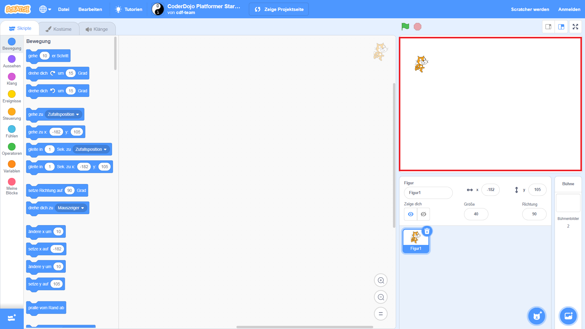
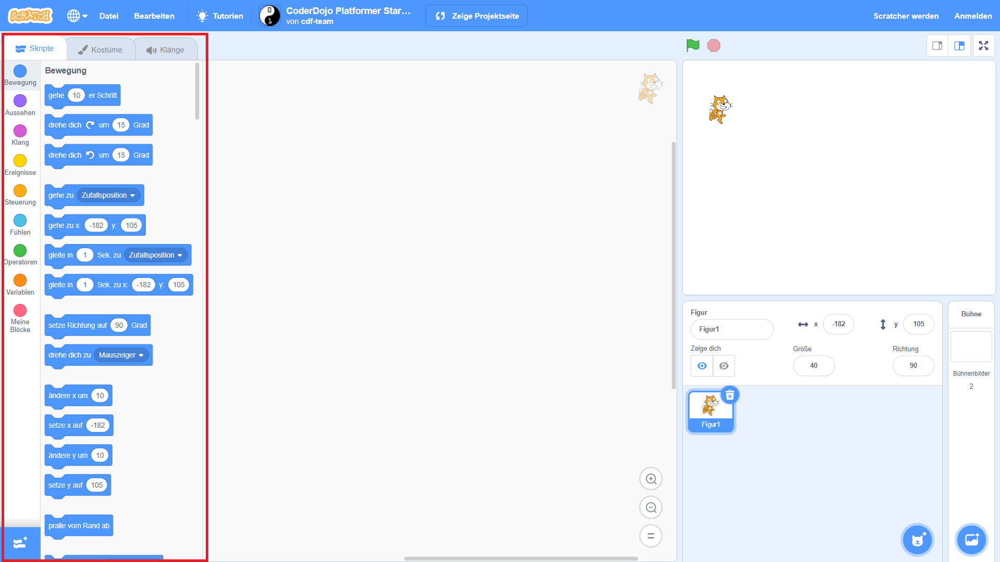
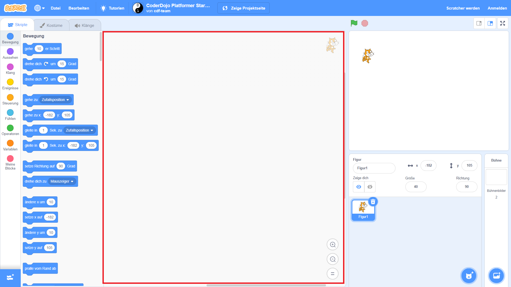
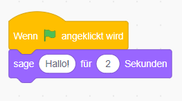

## Getting set up

Once you open Scratch, you’ll see a window like the one below.

\--- Aufgabe \--- Suche nach den folgenden Bereichen und merke dir, wo sie sich befinden. \--- /task \---

### The Stage



## \--- collapse \---

## Titel: Was ist die Bühne?

Hier laufen deine Scratch-Programme. It has:

* Eine oder mehrere **Hintergründe** \(Bilder auf dem Bildschirmhintergrund\)

* Any **code blocks** associated with it \(we’ll get to this\)

\--- /collapse \---

### The sprite list


## \--- collapse \---

## title: What is a sprite?

Any item you can add on the Stage is a **sprite**.

A sprite includes:

* Das **Bild** auf der Bühne
* Any extra **costumes** \(looks\) it has
* Any **sounds** associated with it
* Any **code blocks** associated with it 

\--- /collapse \---

### The code blocks palette



## \--- collapse \---

## title: Codeblöcke

Code in Scratch comes in the form of blocks that you connect to make programs. You choose blocks from the **code blocks palette**, drag them into the **current sprite panel**, and then connect them to each other.

There are ten categories of blocks. They are colour-coded, and you can choose between them by clicking on the items in the list at the top of the **code blocks palette**.

\--- /collapse \---

### The current sprite panel



## \--- collapse \---

## title: What is the current sprite?

The **current sprite** is the one that's selected in the **sprite list**.

The **current sprite panel** is where you can see the code, costumes, and sounds for the selected sprite.

\--- /collapse \---

Time to get coding!

\--- task \--- In the sprite list, click on the Scratch Cat. The cat is now the current sprite.

Choose the **Events** category in the code blocks palette, click the `when flag clicked`{:class="block3events"} block, and drag it into the current sprite panel.

```blocks3
    when green flag clicked
```

\--- /task \---

\--- task \--- Then go to **Looks** in the code blocks palette and find this block:

```blocks3
    say [Hello!] for (2) secs
```

Click on it, hold down the mouse button, and then just drag it into the current sprite panel and let go of the button.

\--- /task \---

\--- task \--- Now that the second block is in the current sprite panel, connect it to the bottom of the first block by clicking and dragging it again to move it below the other block until they snap together, like this:

 \--- /task \---

\--- task \--- Now click the **Start Program** button and watch what happens! \--- /task \---