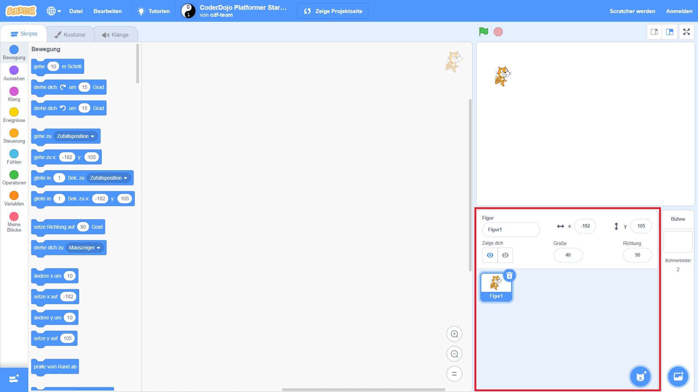

## Erste Schritte

Wenn du Scratch öffnest, wird ein Fenster wie das unten stehende angezeigt.

\--- task \---

Suche nach den folgenden Bereichen und merke dir, wo sie sich befinden.

\--- /task \---

### Die Bühne


## \--- collapse \---

## Titel: Was ist die Bühne?

Hier laufen deine Scratch-Programme. Es hat:

* Eine oder mehrere **Hintergründe** \(Bilder auf dem Bildschirmhintergrund\)

* Alle **Codeblöcke** die mit ihr verbunden sind \(wir werden später dazu kommen\)

\--- /collapse \---

### Die Figuren-Liste



## \--- collapse \---

## Titel: Was ist eine Figur?

Jeder Gegenstand, den du der Bühne hinzufügen kannst, ist eine **Figur**.

Eine Figur beinhaltet:

* Das **Bild** auf der Bühne
* Jedes zusätzliche **Kostüm** \(Aussehen\), dass sie hat
* Alle **Klänge**, die damit verbunden sind
* Alle **Codeblöcke**, die damit verbunden sind 

\--- /collapse \---

### Die Code-Block-Palette


## \--- collapse \---

## title: Codeblöcke

Die Codes in Scratch kommen in Form von Blöcken, die du verbindest, um Programme zu erstellen. Du wählst Blöcke aus der **Code-Block-Palette**, ziehst sie in das **aktuelle Figuren-Panel**und verbindest sie dann miteinander.

Es gibt zehn Kategorien von Blöcken. Sie sind farblich gekennzeichnet. Du kannst zwischen ihnen wählen, indem du auf die Elemente in der Liste oben in der **Codeblock-Palette** klickst.

\--- /collapse \---

### Das aktuelle Figuren-Panel


## \--- collapse \---

## Titel: Was ist die aktuelle Figur?

The **current sprite** is the one that's selected in the **sprite list**.

The **current sprite panel** is where you can see the code, costumes, and sounds for the selected sprite.

\--- /collapse \---

Time to get coding!

\--- task \---

In the sprite list, click on the Scratch Cat. The cat is now the current sprite.

Choose the **Events** category in the code blocks palette, click the `when flag clicked`{:class="block3events"} block, and drag it into the current sprite panel.

```blocks3
    wenn grüne Flagge angeklickt
```

\--- /task \---

\--- task \---

Then go to **Looks** in the code blocks palette and find this block:

```blocks3
    sage [Hallo!] für (2) Sekunden
```

Click on it, hold down the mouse button, and then just drag it into the current sprite panel and let go of the button.

\--- /task \---

\--- task \---

Now that the second block is in the current sprite panel, connect it to the bottom of the first block by clicking and dragging it again to move it below the other block until they snap together, like this:


\--- /task \---

\--- task \---

Now click the **Start Program** button and watch what happens!

\--- /task \---