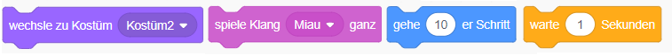
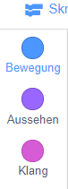
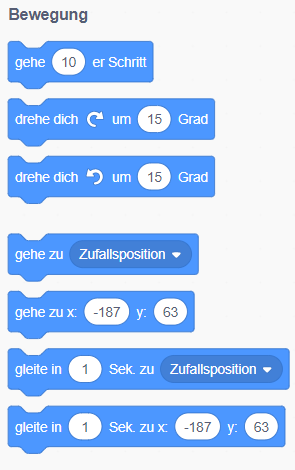
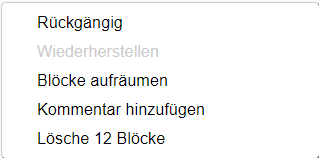

## Codeblöcke hinzufügen und entfernen

Großartig! Du hast dein allererstes Scratch-Programm geschrieben. Zeit, etwas mehr darüber zu lernen, wie Code in Scratch ein- und ausgeblendet wird! Der Scratch-Code besteht aus **Blöcken** wie diesen:



Du findest alle Blöcke in der **Codeblock-Palette**, sortiert nach verschiedenen Kategorien.

## \--- collapse \---

## title: Verwenden von Blöcken aus den verschiedenen Kategorien

Klicke auf einen Kategorienamen, um die Blöcke in dieser Kategorie anzuzeigen. Hier wird die Kategorie **Bewegung** ausgewählt:



Alle Blöcke in der Kategorie, auf die du geklickt hast, werden in einer Liste angezeigt:



Du kannst auf den gewünschten Block klicken, ihn dann in das aktuelle Figuren-Panel ziehen und loslassen. Sobald es sich im Panel befindet, kannst du es verschieben und mit anderen Blöcken verbinden.

\--- /collapse \---

Wenn du sehen möchtest, was ein Block macht, kannst du ihn mit einem Doppelklick ausführen!

\--- task \--- Doppelklicke auf einige Blöcke, um zu sehen, was sie tun. \--- /task \---

## \--- collapse \---

## title: Den Code ausführen

Normalerweise soll dein Code automatisch ausgeführt werden, wenn etwas bestimmtes passiert. Aus diesem Grund beginnen viele deiner Programme mit einem Block aus der Kategorie **Ereignisse**, meistens dieser:

```blocks3
    wenn die grüne flagge angeklickt
```

Die mit diesem Block verbundenen Codeblöcke werden ausgeführt, nachdem die grüne **Flagge** angeklickt wurde.

Codeblöcke laufen von oben nach unten, daher ist die Reihenfolge wichtig, in der du deine Blöcke zusammenfügst. In diesem Beispiel `sagt` die Figur {:class="block3looks"} `Hallo!` bevor der `Miau` Ton {class="block3sound"} `abgespielt` wird.

```blocks3
    Wenn die grüne Flagge angeklickt
sage [Hallo]
spiele Klang [Miau v]
```

\--- /collapse \---

Das Entfernen oder Löschen von Codeblöcken, die du nicht in deinen Programm haben möchtest, ist einfach! Ziehen es es einfach zurück in die Codeblock-Palette.

**Sei vorsichtig:** Wenn du sie in die Palette ziehst, werden alle Blöcke, die mit dem von dir gezogenen Block verbunden sind, gelöscht. Achte darauf, die Codeblöcke, die du entfernen möchtest, von den zu behalten willst, zu trennen. Wenn du einige Codeblöcke versehentlich gelöscht hast und sie zurückbekommen möchtest, klicke mit der rechten Maustaste, und klicke dann auf die Option **Rückgängig**, um alles wiederherzustellen.



\--- task \--- Versuche, einige Codeblöcke hinzuzufügen, zu löschen und wiederherzustellen! \--- /task \---

### Putting it all together

Jetzt weißt du, wie du Code verschieben und Dinge in Bewegung setzen kannst. Jetzt ist es an der Zeit, ein Programm zu erstellen, mit dem die Scratch Katze im Kreis laufen kann!

\--- task \--- Vergewissere dich, dass die Figur Katze in der Figuren-Liste ausgewählt ist, und ziehe die folgenden Blöcke in das Figuren-Fenster, und verbinde sie. Du findest sie in den **Ereignissen** und **Bewegung** Listen.

```blocks3
    Wenn die grüne Flagge angeklickt
  gehe [10] er Schritt
```

\--- /task \---

\--- Aufgabe \--- Klicke jetzt auf die grüne Flagge über der Bühne.

 \--- /task \---

Du solltest die Katze in einer geraden Linie laufen sehen... nicht genau das, was du willst, oder?

Hinweis: Wenn du zu oft auf die Flagge klickst und die Katze weggeht, kannst du sie zurückziehen!

\--- Aufgabe \--- Ziehe den Umdrehen-Block bis zum Ende, damit die Katze-Figur im Kreis läuft. Es ist auch in der **Bewegung** Liste.

```blocks3
    Wenn die grüne Flagge angeklickt
    gehe [10] er Schritt
+   drehe dich nach rechts um (15) Grad
```

\--- /task \---

## \--- collapse \---

## Titel: Wie funktioniert das Drehen?

Durch diesen Block wird die Figur um 15 Grad von den vollen 360 Grad gedreht, die einen Kreis bilden. Du kannst diese Anzahl und die Anzahl der Schritte ändern, indem du auf die Anzahl klickst und einen neuen Wert eingibst.


\--- /collapse \---

\--- Aufgabe \--- Speichere jetzt deine Arbeit! \--- /task \---