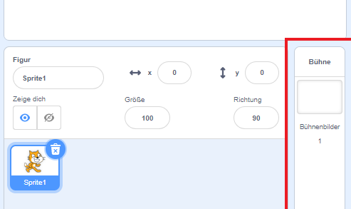
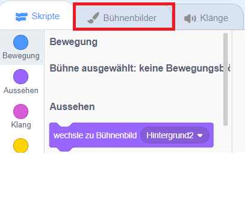
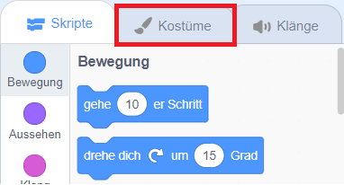
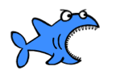
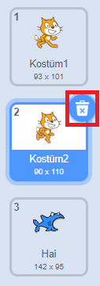

## Einrichten der Szene

Scratch verfügt über eine Bibliothek mit Hintergründen und Figuren, mit denen du dein Projekt fantastisch aussehen lassen kannst.

\--- Aufgabe \--- Wähle die Bühne aus.

Klicke auf **Hintergründe**.

Klicke auf das Symbol **Hintergrund aus Bibliothek auswählen**.

Dann wähle deinen Lieblingsunterwasserhintergrund aus!

 \--- /task \---

Großartig! Natürlich hast du jetzt eine Katze unter Wasser und Katzen sind normalerweise keine großen Fans davon. Aber das kannst du reparieren, weil du die Katze in einen Hai verwandeln kannst!

\--- task \--- Wähle zuerst die Katzenfigur aus und klicke auf die Registerkarte **Kostüme**.

Klicke dann auf **Kostüm aus Bibliothek auswählen**

Wähle dieses Hai-Bild aus und klicke auf **OK**.

Entferne nun die Katzenkostüme, indem du sie auswählst und auf **x**klickst.

 \--- /task \---

Jetzt hast du einen Hai - ausgezeichnet!