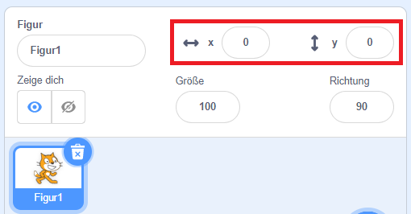

## Dinge bewegen

Jetzt bewegt sich dein Hai im Kreis und es wäre viel mehr Spaß, ihn mit den Pfeiltasten zu steuern. Auf dieser Karte wirst du lernen, wie das geht!

\--- Aufgabe \--- Beginne mit dem Löschen des gesamten Codes, den du für den Hai hast. \--- /task \---

Wie du wahrscheinlich schon vermutet hast, benötigst du wieder **Ereignis** und **Bewegungs**-Blöcke!

\--- task \--- Suche diesmal nach diesem Block und ziehe ihn in das aktuelle Figuren-Panel:

```blocks3
    Wenn Taste [Leertaste v] gedrückt wird
```

Klicke auf den kleinen Pfeil (▼) neben der `Leertaste`. Du siehst eine Liste aller Tastaturtasten, aus denen du auswählen kannst. \--- /task \---

Du benötigst vier der `wenn Taste gedrückt wird`{:class="block3events"} Blöcke - einen für jede deiner Pfeiltasten.

\--- task \--- Damit sich dein Hai bewegt, verbindest du diese Blöcke mit **Bewegungs** Blöcken wie folgt:

```blocks3
    Wenn Taste [Pfeil nach links v] gedrückt wird
gehe (-10) er Schritt
```

```blocks3
    Wenn Taste [Pfeil nach rechts v] gedrückt wird
   gehe (-10) er Schritt
```

```blocks3
    Wenn Taste [Pfeil nach oben v] gedrückt wird
```

```blocks3
    Wenn Taste [Pfeil nach unten v] gedrückt wird
```

\--- /task \---

**Hinweis**: `-10` bedeutet '10 Schritte zurück'.

\--- task \--- Klicke nun auf die grüne Flagge, um deinen Code zu testen. \--- /task \---

Jetzt bewegt sich dein Hai vor und zurück, was ziemlich cool ist, aber nicht nach oben oder unten. Wenn du die **Bewegung** Blöcke durchsiehst, siehst du, dass es keine Blöcke für 'hoch' oder 'runter' gibt. Es gibt jedoch eine ganze Reihe von ihnen, die sich auf die Koordinaten **x** und **y** beziehen - lass uns die ausprobieren!

\--- task \--- Nimm zwei `ändere y um`{:class="block3motion"}-Blöcke und aktualisiere deinen Code folgendermaßen:

```blocks3
    Wenn Taste [Pfeil nach oben v] gedrückt wird
+    ändere y um (10)
```

```blocks3
    Wenn Taste [Pfeil nach unten v] gedrückt wird
+    ändere y um (-10)
```

\--- /task \---

Wenn du jetzt die Pfeiltasten drückst bewegt sich der Hai auf der Bühne!

## \--- collapse \---

## Titel: Wie funktionieren X- und Y-Koordinaten?

Um über die Positionen von Objekten wie Figuren zu sprechen, verwenden wir häufig X- und Y-Koordinaten. Die **x-Achse** des Bühnen-Koordinatensystems verläuft von **links nach rechts**und die **y-Achse** von **unten nach oben**.


Ein Sprite kann durch die Koordinaten seines Mittelpunkts lokalisiert werden, zum Beispiel `(15, -27)`, wobei `15` seine Position entlang der x-Achse und `27` seine Position entlang der y-Achse ist.

+ Um ein Gefühl für die tatsächliche Funktionsweise zu erhalten, wähle eine Figur aus und verschiebe sie mit den Steuerelementen **x** und **y** auf der Bühne, indem du verschiedene Werte für die Koordinaten festlegst.



+ Probiere verschiedene Wertepaare aus, um zu sehen, wohin die Figur geht! In Scratch geht die x-Achse von `-240` bis `240`und die y-Achse von `-180` bis `180`.

\--- /collapse \---

### Spiel neu starten

Der Hai bewegt sich jetzt über den gesamten Bildschirm, aber stelle dir vor, es handelt sich um ein Spiel: Wie startest du es neu und was passiert zu Beginn jedes Spiels?

Du musst den Hai an seinen ursprünglichen Ort bringen, wenn der Spieler das Spiel startet. Du startest dieses Spiel, indem du auf die grüne Flagge klickst. In diesem Fall musst du die X- und Y-Koordinaten der Hai-Figur ändern.

Das ist eigentlich ziemlich einfach! Die Mitte der Bühne ist `(0, 0)` in `(x, y)` Koordinaten.

Du brauchen also nur einen **Ereignis**-Block für diese grüne Flagge, und einen **Gehe zu**-Block von **Bewegung**.

\--- task \--- Ziehe eine `wenn die grüne Flagge angeklickt`{:class="block3events"} **Ereignis**-Block, auf das aktuelle Figuren-Panel.

```blocks3
    Wenn die grüne Flagge angeklickt
```

Suche dann den `Gehe zu`{:class="block3motion"} **Bewegung** Block und hänge ihn an den **Ereignis** Block an.

```blocks3
    Wenn die grüne Flagge angeklickt
+  gehe zu x: (0) y: (0)
```

Setze sowohl die `x` als auch die `y` -Koordinate auf `0` im `Gehe zu`{:class="block3motion"}-Block, wenn sie nicht bereits `0` sind.

\--- /task \---

\--- Aufgabe \--- Klicke jetzt auf die grüne Flagge: Du solltest sehen, wie der Hai in die Mitte der Bühne zurückkehrt! \--- /task \---