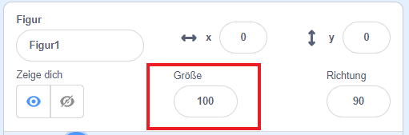
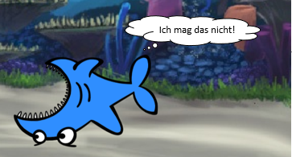

## Alle Figuren

Jetzt hast du einen Hai, den du mit den Pfeiltasten bewegen kannst. Klasse! Zeit, ein paar Fische hinzuzufügen, die er fangen kann.

\--- task \---

Klicke auf die Schaltfläche **Neue Figur**, und wähle auf dem Bildschirm einen Fisch aus.


Wenn dein Fisch im Vergleich zu deinem Hai ein bisschen groß ist, kannst du mit der Größensteuerung beide Figuren auf die richtige Größe bringen!



Ändere die Zahl in der Größensteuerung, um die Figur größer oder kleiner zu machen.

\--- /task \---

Großartig! Später fügst du Code hinzu, damit sich der Fisch ohne Hilfe des Spielers von alleine bewegen kann. Dein Spieler wird den Hai bewegen und versuchen, den Fisch zu fangen.

## \--- collapse \---

## Titel: Was ist mit dem rückwärts schwimmenden Hai?

Es sieht ein bisschen komisch aus, wenn der Hai nach rückwärts schwimmt. So wie du dich normalerweise umdrehst anstatt rückwärts zu gehen, würde sich der Hai eher umdrehen als rückwärts zu schwimmen. Zum Glück hat Scratch dafür einen Block!

Mit dem `Drehe in Richtung`{:class="block3motion"} kannst du die Richtung auswählen, in die deine Figur zeigt. Du findest es im Bereich **Bewegung** Blöcke. Du kannst einen beliebigen Wert in Grad eingeben, um die Figur auszurichten, wie du möchtest.

\--- /collapse \---

\--- task \---

Grab a couple of copies of the `point in direction`{:class="block3motion"} block from the **Motion** list and connect them to your shark's code, like this:

```blocks3
    Wenn Taste [Pfeil nach links v] gedrückt wird
+    setze Richtung auf (-90) Grad
    gehe (10) er Schritt
```

```blocks3
    Wenn Taste [Pfeil nach rechts v] gedrückt wird
+    setze Richtung auf (90) Grad
    gehe (10) er Schritt
```

\--- /task \---

\--- task \---

Change the number of steps in the `move`{:class="block3motion"} blocks from `-10` to `10`.

If you try moving the shark around now after you've added the `point in direction`{:class="block3motion"} blocks, you might notice something a little strange happening. The shark may not be turning quite right!



\--- /task \---

## \--- collapse \---

## titel: Warum steht es auf dem Kopf?

The problem here is that the shark sprite started, as all sprites do, with the 'all around' **rotation style**, and what you need it to have is the 'left-right' style.

As usual, there’s a block for that, and it’s in **Motion**!

\--- /collapse \---

\--- task \---

Look in the **Motion** category for the block `set rotation style`{:class="block3motion"}.

Add the block to your shark reset code from earlier, and set the rotation style to `left-right`{:class="block3motion"}, like this:

```blocks3
    Wenn die grüne Flagge angeklickt
+    setze Drehtyp auf [links-rechts v]
     gehe zu x: (0) y: (0)
```

\--- /task \---