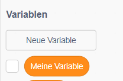
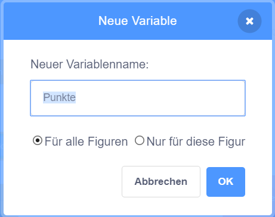

## Mitzählen

Damit die Anzahl der Fische, die der Spieler fängt, erhalten bleibt, benötigst du eine Stelle, an der du die Punktezahl speichern kannst, eine Möglichkeit, diese hinzuzufügen und sie zurückzusetzen, wenn das Spiel neu gestartet wird.

Erstens: Speichern der Punktzahl!

\--- task \---

Go to the **Variables** blocks category and click on **Make a Variable**.



Enter `score` as the name.



Check out your new variable!


\--- /task \---

## \--- collapse \---

## Titel: Was sind Variablen?

When you want to store information in a program, you use something called a **variable**. Think of it like a box with a label on it: you can put something in it, check what’s in it, and change what’s in it. You’ll find variables in the **Variables** section, but you need to create them first for them to show up there!

\--- /collapse \---

Now you need to update the variable whenever the shark eats a fish, and to reset it when the game is restarted. Doing both is pretty easy:

\--- task \---

From the **Variables** section, take the `set [my variable v] to [0]`{:class="block3variables"} and `change [my variable v] by [1]`{:class="block3variables"} blocks. Click on the little arrows in the blocks, choose `score` from the list, and then put the blocks into your program:

### Code für den Hai

```blocks3
    Wenn die grüne Flagge angeklickt
+     setze [Punkte v] auf [0]
   setze Drehtyp auf [links-rechts v]
   gehe zu x: (0) y: (0)
```

### Code für den Fisch

```blocks3
    falls <touching [Sprite1 v] ?>, dann 
+          ändere [Punkte v] um [1]
         verstecke dich
         warte (1) Sekunden
         gehe zu x: (Zufallszahl von (-240) bis (240)) y: (Zufallszahl von (-180) bis (180))
         zeige dich
   ende

```

\--- /task \---

Cool! Now you’ve got a score and everything.