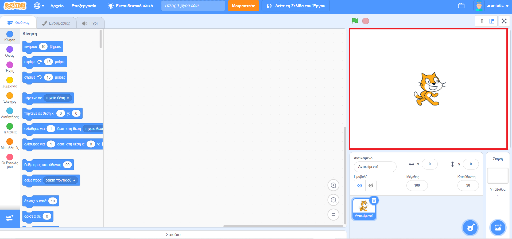

## Ξεκινώντας

Μόλις ανοίξεις το Scratch, θα δεις ένα παράθυρο όπως το παρακάτω.

\--- task \---

Δες καθεμία από τις παρακάτω περιοχές και να θυμάσαι πού βρίσκονται.

\--- /task \---

### Η σκηνή



## \--- collapse \---

## title: Τι είναι η σκηνή;

Εκεί εκτελούνται τα προγράμματα στο Scratch. Περιλαμβάνει:

* Ένα ή περισσότερα **υπόβαθρα** \(εικόνες φόντου στο πίσω μέρος της οθόνης\)

* Οποιοδήποτε **μπλοκ κώδικα** που σχετίζεται με αυτή \(θα το δούμε αργότερα\)

\--- /collapse \---

### Τη λίστα των αντικειμένων


## \--- collapse \---

## title: Τι είναι ένα αντικείμενο;

Οποιοδήποτε στοιχείο που μπορείς να προσθέσεις στη σκηνή είναι ένα **αντικείμενο**.

Ένα αντικείμενο περιλαμβάνει:

* Την **εικόνα** στη σκηνή 
* Τις επιπλέον **ενδυμασίες** \(εικόνες\) που μπορεί να έχει
* **Ήχους** που μπορεί να συνδέονται με αυτό
* Οποιαδήποτε **μπλοκ κώδικα** που συνδέονται με αυτό 

\--- /collapse \---

### Την παλέτα εντολών


## \--- collapse \---

## title: Μπλοκ κώδικα

Ο κώδικας στο Scratch έχει τη μορφή μπλοκ που συνδέονται μεταξύ τους και σχηματίζουν προγράμματα. Επιλέγεις μπλοκ από την **παλέτα εντολών**, τα σέρνεις στην **περιοχή του επιλεγμένου αντικειμένου** και, στη συνέχεια, τα ενώνεις μεταξύ τους.

Υπάρχουν δέκα κατηγορίες μπλοκ. Είναι χρωματικά κωδικοποιημένα και μπορείς να επιλέξεις ανάμεσά τους κάνοντας κλικ στα στοιχεία της λίστας στο επάνω μέρος της **παλέτας εντολών**.

\--- /collapse \---

### Η περιοχή του επιλεγμένου αντικειμένου


## \--- collapse \---

## title: Τι είναι το επιλεγμένο αντικείμενο;

Το **επιλεγμένο αντικείμενο** είναι αυτό που έχει επιλεχθεί στη **λίστα αντικειμένων**.

Η **περιοχή του επιλεγμένου αντικειμένου** είναι εκεί που μπορείς να δεις τον κώδικα, τις ενδυμασίες και τους ήχους του επιλεγμένου αντικειμένου.

\--- /collapse \---

Ώρα για κώδικα!

\--- task \---

Στη λίστα αντικειμένων, κάνε κλικ στη γάτα του Scratch. Η γάτα είναι τώρα το επιλεγμένο αντικείμενο.

Επίλεξε την κατηγορία **Συμβάντα/0> στην παλέτα εντολών, κάνε κλικ στο μπλοκ `όταν γίνει κλικ σε σημαία`{:class="block3events"}, και σύρε το στην περιοχή του επιλεγμένου αντικειμένου.</p> 

```blocks3
    when green flag clicked
```

\--- /task \---

\--- task \---

Μετά πήγαινε στις **Όψεις** στην παλέτα εντολών και βρες αυτό το μπλοκ:

```blocks3
    say [Hello!] for (2) secs
```

Κάνε κλικ σε αυτό, και κρατώντας πατημένο το κουμπί του ποντικιού σύρε το μπλοκ στην περιοχή του επιλεγμένου αντικειμένου και άφησε το κουμπί.

\--- /task \---

\--- task \---

Τώρα που και το δεύτερο μπλοκ βρίσκεται στην περιοχή του επιλεγμένου αντικειμένου, κόλλησε το στο κάτω μέρος του πρώτου μπλοκ κάνοντας κλικ και σέρνοντάς το ξανά για να το μετακινήσεις κάτω από το άλλο μπλοκ μέχρι να κουμπώσουν μαζί, όπως παρακάτω:


\--- /task \---

\--- task \---

Τώρα κάνε κλικ στο κουμπί **Ξεκίνα** και δες τι συμβαίνει!

\--- /task \---