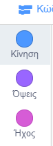
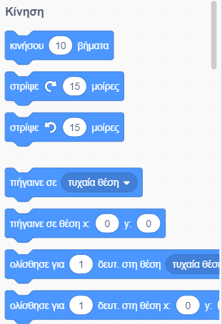
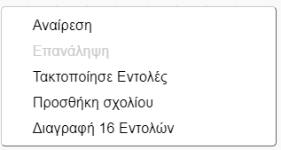

## Προσθήκη και αφαίρεση μπλοκ κώδικα

Εξαιρετικά! Έχεις γράψει το πρώτο σου πρόγραμμα στο Scratch. Ώρα να μάθεις περισσότερα σχετικά με την προσθήκη ή αφαίρεση κώδικα στο Scratch! Ο κώδικας στο Scratch αποτελείται από **μπλοκ** όπως αυτά:


Θα βρεις όλα τα μπλοκ στην **παλέτα εντολών**, ταξινομημένα σε κατηγορίες ανάλογα με το τι κάνουν.

--- collapse ---
---
title: Χρησιμοποιώντας μπλοκ από διαφορετικές κατηγορίες
---

Κάνε κλικ στο όνομα μιας κατηγορίας για να δεις τα μπλοκ αυτής της κατηγορίας. Εδώ είναι επιλεγμένη η κατηγορία **Κίνηση**:



Όλα τα μπλοκ στην κατηγορία που έχεις επιλέξει εμφανίζονται σε μια λίστα:



Μπορείς να κάνεις κλικ στο μπλοκ που θέλεις και, στη συνέχεια, να το σύρεις στην περιοχή του επιλεγμένου αντικειμένου και να το αφήσεις. Μόλις βρεθεί στην περιοχή του αντικειμένου, μπορείς να το μετακινήσεις και να το συνδέσεις με άλλα μπλοκ.

--- /collapse ---

Εάν θέλεις να δεις τι κάνει ένα μπλοκ, μπορείς να κάνεις διπλό κλικ σε αυτό για να το κάνεις να τρέξει!

--- task ---

Δοκίμασε να κάνεις διπλό κλικ σε μερικά από τα μπλοκ για να δεις τι κάνουν.

--- /task ---

--- collapse ---
---
title: Εκτέλεση του κώδικα
---

Συνήθως, θέλεις ο κώδικάς σου να εκτελείται αυτόματα κάθε φορά που συμβαίνει κάτι συγκεκριμένο. Γι'αυτό το λόγο πολλά από τα προγράμματά σου θα ξεκινούν με ένα μπλοκ από την κατηγορία **Συμβάντα**, με συχνότερο αυτό:

```blocks3
    when green flag clicked
```

Τα μπλοκ κώδικα που είναι συνδεδεμένα σε αυτό το μπλοκ θα εκτελεστούν αφού κάνεις κλικ στην **πράσινη σημαία**.

Τα μπλοκ κώδικα τρέχουν από πάνω προς τα κάτω, οπότε έχει σημασία η σειρά με την οποία βάζεις τα μπλοκ σου. Σε αυτό το παράδειγμα, το αντικείμενο θα `πει`{:class="block3looks"}`Γεια` πριν `παίξει`{:class="block3sound"} τον ήχο `meow`.

```blocks3
    when green flag clicked
    say [Γεια!]
    play sound [meow v]
```

--- /collapse ---

Η αφαίρεση ή διαγραφή μπλοκ κώδικα που δεν θέλεις στο πρόγραμμά σου είναι εύκολη! Απλώς σύρε τα πίσω στην παλέτα εντολών.

**Πρόσεξε:** σέρνοντας τα στην παλέτα εντολών θα διαγραφούν όλα τα μπλοκ που είναι ενωμένα στο μπλοκ που σέρνεις, οπότε φρόντισε να διαχωρίζεις τα μπλοκ κώδικα που θέλεις να διατηρήσεις από αυτά που θέλεις να διαγράψεις. Εάν διαγράψεις κάποια μπλοκ κώδικα κατά λάθος και θέλεις να τα επαναφέρεις, κάνε δεξί κλικ και στη συνέχεια επίλεξε την **Αναίρεση** για να τα επαναφέρεις πίσω.



--- task ---

Δοκίμασε να προσθέσεις, να διαγράψεις και να αναιρέσεις τη διαγραφή κάποιων μπλοκ κώδικα!

--- /task ---

### Συνδυάζοντας τα όλα μαζί

Τώρα που ξέρεις πως να μετακινείς κώδικα και να κάνεις πράγματα να συμβούν, ήρθε η ώρα να δημιουργήσεις ένα πρόγραμμα για να κάνεις τη γάτα του Scratch να περπατάει σε κύκλο!

--- task ---

Βεβαιώσου ότι έχεις επιλέξει το αντικείμενο της γάτας στη λίστα αντικειμένων και, στη συνέχεια, σύρε τα ακόλουθα μπλοκ στην περιοχή του αντικειμένουν και ένωσέ τα. Θα τα βρεις στις κατηγορίες **Συμβάντα** και **Κίνηση**.

```blocks3
    when green flag clicked
    move [10] steps
```

--- /task ---

--- task ---

Τώρα, κάνε κλικ στην πράσινη σημαία πάνω από τη σκηνή.


--- /task ---

Θα δεις τη γάτα να περπατάει σε ευθεία γραμμή... όχι ακριβώς αυτό που θέλεις, έτσι;

Σημείωση: Εάν κάνεις κλικ στη σημαία πάρα πολλές φορές και η γάτα απομακρυνθεί, μπορείς να τη σύρεις πίσω!

--- task ---

Τοποθέτησε το μπλοκ στροφή στο τέλος για να κάνεις το αντικείμενο γάτα να περπατήσει σε κύκλο. Βρίσκεται κι αυτό στην κατηγορία **Κίνηση**.

```blocks3
    when green flag clicked
    move [10] steps
+    turn cw (15) degrees
```

--- /task ---

--- collapse ---
---
title: Πώς λειτουργεί η στροφή;
---

Αυτό το μπλοκ κάνει το αντικείμενο να γυρίσει 15 μοίρες από τις 360 μοίρες που αποτελούν έναν κύκλο. Μπορείς να αλλάξεις αυτόν τον αριθμό και τον αριθμό των βημάτων, κάνοντας κλικ στον αριθμό και πληκτρολογώντας μια νέα τιμή.


--- /collapse ---

--- task ---

Αποθήκευσε τώρα τη δουλειά σου!

--- /task ---