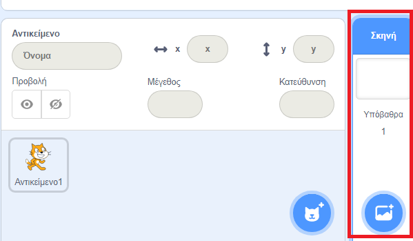
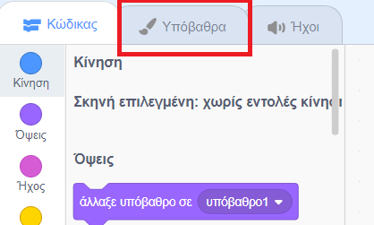
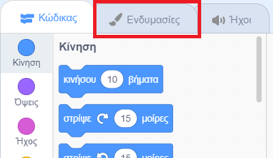

## Στήνοντας τη σκηνή

Το Scratch διαθέτει μια βιβλιοθήκη από έτοιμα υπόβαθρα και αντικείμενα για να κάνεις να έργα σου να φαίνονται υπέροχα.

\--- task \---

Επίλεξε τη Σκηνή.

Κάνε κλικ στα **Υπόβαθρα**.

Επίλεξε το εικονίδιο **Επιλέξτε Υπόβαθρο**.

Στη συνέχεια, επίλεξε το αγαπημένο σου υποβρύχιο φόντο!

\--- /task \---

Εξαιρετικά! Φυσικά, τώρα έχεις μια γάτα κάτω από το νερό, και ξέρεις ότι οι γάτες δεν χαίρονται πολύ με αυτό. Αλλά μπορείς να το διορθώσεις αυτό, γιατί μπορείς να μετατρέψεις τη γάτα σε καρχαρία!

\--- task \---

Αρχικά, επίλεξε το αντικείμενο της γάτας και κάνε κλικ στην καρτέλα **Ενδυμασίες**.

Στη συνέχεια, κάνε κλικ στο **Επιλέξτε Ενδυμασία**

Επίλεξε την εικόνα με τον καρχαρία.

Τώρα αφαίρεσε τις ενδυμασίες της γάτας επιλέγοντας καθεμία από αυτές και κάνοντας κλικ στο **x**.

\--- /task \---

Τώρα έχεις έναν καρχαρία - εξαιρετικά!