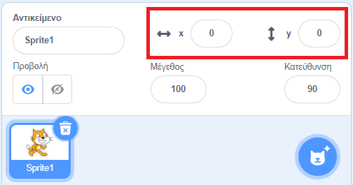

## Κίνηση αντικειμένων

Τώρα ο καρχαρίας σου κινείται σε κύκλο και θα ήταν πολύ πιο διασκεδαστικό να τον ελέγχεις με τα βελάκια του πληκτρολογίου. Σε αυτήν την καρτέλα, θα μάθεις πώς να το κάνεις αυτό!

--- task ---

Ξεκίνησε διαγράφοντας όλο τον κώδικα που έχεις για τον καρχαρία.

--- /task ---

Όπως μάλλον μάντεψες, πάλι θα χρειαστείς μπλοκ από τις κατηγορίες **Συμβάντα** και **Κίνηση**!

--- task ---

Αυτή τη φορά, βρες αυτό το μπλοκ και σύρε το στην περιοχή του επιλεγμένου αντικειμένου:

```blocks3
    when [space v] key pressed
```

Κάνε κλικ στο βελάκι (▼) δίπλα στο `διάστημα`. Θα δεις μια λίστα με όλα τα κουμπιά του πληκτρολογίου σου, τα οποία μπορείς να επιλέξεις.

--- /task ---

Θα χρειαστείς τέσσερα μπλοκ από τα `όταν πατηθεί το πλήκτρο`{:class="block3events"} - ένα για κάθε βελάκι.

--- task ---

Για να μετακινήσεις τον καρχαρία σου, ένωσε αυτά τα μπλοκ με τα μπλοκ **Κίνησης**, όπως παρακάτω:

```blocks3
    when [left arrow v] key pressed
    move (-10) steps
```

```blocks3
    when [right arrow v] key pressed
    move (10) steps
```

```blocks3
    when [up arrow v] key pressed
```

```blocks3
    when [down arrow v] key pressed
```

--- /task ---

**Σημείωση**: `-10` σημαίνει 'πήγαινε πίσω 10 βήματα'.

--- task ---

Τώρα κάνε κλικ στην πράσινη σημαία για να ελέγξεις τον κώδικά σου.

--- /task ---

Τώρα ο καρχαρίας σου κινείται πίσω και μπροστά, κάτι που είναι αρκετά εντυπωσιακό, αλλά δεν κινείται πάνω και κάτω. Επίσης, αν κοιτάξεις το μενού **Κίνηση**, θα δεις ότι δεν υπάρχουν μπλοκ για 'πάνω' ή 'κάτω'. Υπάρχουν όμως πολλά μπλοκ που σχετίζονται με συντεταγμένες **x** και **y** - ας δοκιμάσουμε αυτά τότε!

--- task ---

Σύρε δύο μπλοκ `άλλαξε y κατά`{:class="block3motion"}, και άλλαξε τον κώδικα ως εξής:

```blocks3
    when [up arrow v] key pressed
+     change y by (10)
```

```blocks3
    when [down arrow v] key pressed
+     change y by (-10)
```

--- /task ---

Τώρα όταν πατήσεις τα βελάκια, ο καρχαρίας κινείται σε όλη τη σκηνή!

--- collapse ---
---
title: Πώς λειτουργούν οι συντεταγμένες x και y;
---

Για να μιλήσουμε για τις θέσεις των αντικειμένων χρησιμοποιούμε συχνά συντεταγμένες x και y. Ο **άξονας x** του συστήματος συντεταγμένων της σκηνής τρέχει από **αριστερά προς τα δεξιά** και ο άξονας **y** τρέχει από **κάτω προς τα πάνω**.


Ένα αντικείμενο μπορεί να εντοπιστεί από τις συντεταγμένες του κέντρου του, για παράδειγμα `(15, -27)` , όπου `15` είναι η θέση του κατά μήκος του άξονα x και `-27` η θέση του κατά μήκος του άξονα y.

+ Για να αποκτήσεις μια αίσθηση για το πώς λειτουργεί αυτό, επίλεξε ένα αντικείμενο και άλλαξε τις τιμές **x** και **y** για να το μετακινήσεις στη σκηνή, ορίζοντας διαφορετικές τιμές για τις συντεταγμένες του.



+ Δοκίμασε διαφορετικά ζευγάρια τιμών για να δεις που πηγαίνει το αντικείμενο! Στο Scratch, ο άξονας x ξεκινά από `-240` και φτάνει ως το `240`, ενώ ο άξονας y ξεκινά από `-180` και φτάνει έως το `180`.

--- /collapse ---

### Επανεκκίνηση του παιχνιδιού

Ο καρχαρίας κινείται σε όλη την οθόνη τώρα, αλλά φαντάσου ότι είναι ένα παιχνίδι: πώς μπορείς να το επανεκκινήσεις και τι συμβαίνει στην αρχή κάθε παιχνιδιού;

Πρέπει να μεταφέρεις τον καρχαρία στην αρχική του θέση, όταν ξεκινήσει το παιχνίδι. Το παιχνίδι ξεκινάει κάνοντας κλικ στην πράσινη σημαία, οπότε πρέπει να αλλάξεις τις συντεταγμένες x και y του καρχαρία όταν συμβεί αυτό.

Αυτό είναι πολύ εύκολο! Το κέντρο της σκηνής είναι `(0, 0)` σε συντεταγμένες `(x, y)`.

Έτσι, το μόνο που χρειάζεσαι είναι το μπλοκ με την πράσινη σημαία από τα **Συμβάντα** και το μπλοκ **πήγαινε σε θέση x και y** από την **Κίνηση**.

--- task ---

Σύρε ένα μπλοκ `όταν γίνει κλικ σε πράσινη σημαία`{:class="block3events"} από τα **Συμβάντα** στην περιοχή του επιλεγμένου αντικειμένου.

```blocks3
    when green flag clicked
```

Στη συνέχεια, βρες το μπλοκ `πήγαινε σε θέση`{:class="block3motion"} από την καρτέλα **Κίνηση** και ένωσέ το με το μπλοκ της σημαίας από τα **Συμβάντα**.

```blocks3
    when green flag clicked
+     go to x: (0) y: (0)
```

Βάλε και στις δύο συντεταγμένες `x` και `y` τιμή `0` στο μπλοκ `πήγαινε στη θέση`{:class="block3motion"}, εάν δεν είναι ήδη `0`.

--- /task ---

--- task ---

Τώρα κάνε κλικ στην πράσινη σημαία: θα πρέπει να δεις τον καρχαρία να επιστρέφει στο κέντρο της σκηνής!

--- /task ---