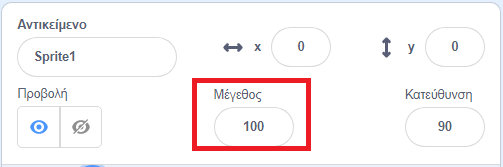
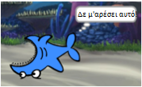

## Όλα τα αντικείμενα

Τώρα έχεις έναν καρχαρία που μπορεί να μετακινηθεί χρησιμοποιώντας τα βελάκια. Τέλεια! Ώρα να προσθέσουμε και κανένα ψάρι.

--- task ---

Κάντε κλικ στο κουμπί **Επιλέξτε ένα Αντικείμενο** και στην οθόνη που ανοίγει, επιλέξτε ένα ψάρι.


Εάν το ψάρι σου είναι λίγο μεγάλο σε σύγκριση με τον καρχαρία σου, μπορείς να χρησιμοποιήσεις τον έλεγχο μεγέθους για να έχεις και τα δύο αντικείμενα στο σωστό μέγεθος!



Άλλαξε τον αριθμό στον έλεγχο μεγέθους για να κάνεις το αντικείμενο μεγαλύτερο ή μικρότερο.

--- /task ---

Εξαιρετικά! Αργότερα, θα προσθέσεις κάποιες εντολές για να κάνεις το ψάρι να κινείται μόνο του, χωρίς βοήθεια από τον παίκτη. Ο παίκτης σου θα μετακινεί τον καρχαρία και θα προσπαθεί να πιάσει το ψάρι.

--- collapse ---
---
title: Τι γίνεται με τον ανάποδο καρχαρία;
---

Φαίνεται λίγο αστείο όταν ο καρχαρίας κολυμπά προς τα πίσω. Ακριβώς, όπως συνήθως θα γύριζες ανάποδα αντί να περπατάς προς τα πίσω, ο καρχαρίας γυρίζει ανάποδα αντί να κολυμπάει προς τα πίσω. Ευτυχώς για σένα, το Scratch έχει ένα μπλοκ για αυτό!

Το μπλοκ `δείξε προς κατεύθυνση`{:class="block3motion"} σου επιτρέπει να επιλέξεις την κατεύθυνση που δείχνει το αντικείμενο. Θα το βρεις στην καρτέλα **Κίνηση**. Μπορείς να πληκτρολογήσεις οποιονδήποτε αριθμό μοιρών περιστροφής, για να στρίψει το αντικείμενο προς οποιαδήποτε κατεύθυνση θέλεις.

--- /collapse ---

--- task ---

Πάρε μερικά μπλοκ `δείξε προς κατεύθυνση`{:class="block3motion"} από την **Κίνηση** και ένωσε τα με τον κώδικα του καρχαρία σου, ως εξής:

```blocks3
    when [left arrow v] key pressed
+     point in direction (-90)
    move (10) steps
```

```blocks3
    when [right arrow v] key pressed
+     point in direction (90)
    move (10) steps
```

--- /task ---

--- task ---

Άλλαξε τον αριθμό των βημάτων στα μπλοκ `Κίνησης`{:class="block3motion"} από `-10` σε `10`.

Εάν προσπαθήσεις να μετακινήσεις τον καρχαρία τώρα, αφού έχεις προσθέσει το μπλοκ ` δείξε προς κατεύθυνση`{:class="block3motion"}, μπορεί να παρατηρήσεις κάτι περίεργο. Ο καρχαρίας μάλλον στρίβει λίγο παράξενα!



--- /task ---

--- collapse ---
---
title: Γιατί πηγαίνει ανάποδα;
---

Το πρόβλημα εδώ είναι ότι το αντικείμενο καρχαρίας ξεκίνησε, όπως κάνουν όλα τα αντικείμενα, με τον **τρόπο περιστροφής** 'τριγύρω' και αυτό που χρειάζεται είναι το 'αριστερά-δεξιά'.

Ως συνήθως, υπάρχει ένα μπλοκ για αυτό, και βρίσκεται στη **Κίνηση**!

--- /collapse ---

--- task ---

Ψάξε στην κατηγορία **Κίνηση** για το μπλοκ `όρισε τρόπο περιστροφής`{:class="block3motion"}.

Πρόσθεσε το μπλοκ στην αρχή του κώδικα του καρχαρία και όρισε τον τρόπο περιστροφής σε `αριστερά-δεξιά`{:class="block3motion"}, όπως αυτό:

```blocks3
    when green flag clicked
+     set rotation style [left-right v]
    go to x: (0) y: (0)
```

--- /task ---