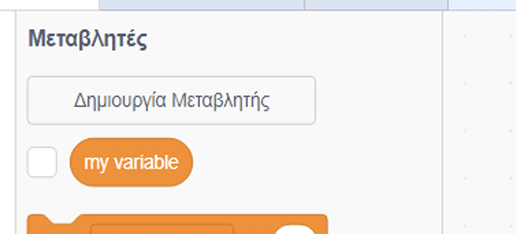
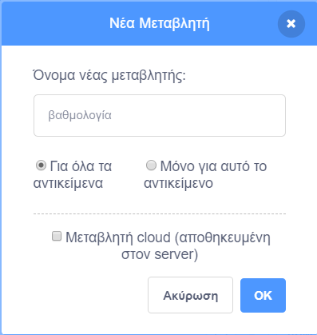
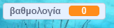

## Μέτρηση της βαθμολογίας

Για να μετράς τη βαθμολογία για το πόσα ψάρια πιάνει ο παίκτης, θα χρειαστείς κάπου να το αποθηκεύεις, να βρεις έναν τρόπο να προσθέτεις πόντους σε αυτό και έναν τρόπο επαναφοράς του κατά την επανεκκίνηση του παιχνιδιού.

Πρώτον: αποθήκευση της βαθμολογίας!

\--- task \---

Κάνε κλικ στην καρτέλα **Μεταβλητές** και, στη συνέχεια, κάνε κλικ στη **Δημιουργία Μεταβλητής**.



Βάλε για όνομα τη `βαθμολογία`.



Δες τη νέα σου μεταβλητή!



\--- /task \---

## \--- collapse \---

## title: Τι είναι οι μεταβλητές;

Όταν θέλεις να αποθηκεύσεις πληροφορίες σε ένα πρόγραμμα, χρησιμοποιείς κάτι που ονομάζεται **μεταβλητή**. Σκέψου το σαν ένα κουτί με μια ετικέτα: μπορείς να βάλεις κάτι μέσα σε αυτό, να ελέγξεις τι υπάρχει και να αλλάξεις αυτό που βρίσκεται μέσα με κάτι άλλο. Θα βρεις τις μεταβλητές στην καρτέλα **Μεταβλητές**, αλλά πρέπει να τις δημιουργήσεις πρώτα για να εμφανιστούν εκεί!

\--- /collapse \---

Τώρα πρέπει να ενημερώσεις τη μεταβλητή κάθε φορά που ο καρχαρίας τρώει ένα ψάρι και να την επαναφέρεις κάθε φορά που ξεκινάει το παιχνίδι. Και τα δύο είναι αρκετά εύκολα:

\--- task \---

Από τις **Μεταβλητές**, πάρε τα μπλοκ `όρισε [η μεταβλητή μου] σε [0]`{:class="block3variables"} και `άλλαξε [η μεταβλητή μου] κατά [1]`{:class="block3variables"}. Κάνε κλικ στα βελάκια των μπλοκ, επίλεξε τη `βαθμολογία` από τη λίστα και, στη συνέχεια, τοποθέτησε τα μπλοκ στο πρόγραμμά σου:

### Κώδικας για τον καρχαρία

```blocks3
    when green flag clicked
+    set [score v] to [0]
    set rotation style [left-right v]
    go to x: (0) y: (0)
```

### Κώδικας για τα ψάρια

```blocks3
    if <touching [Sprite1 v] ?> then
+        change [score v] by [1]
        hide
        wait (1) secs
        go to x: (pick random (-240) to (240)) y: (pick random (-180) to (180))
        show
    end
```

\--- /task \---

Τέλεια! Τώρα έχεις βαθμολογία και είσαι έτοιμος.