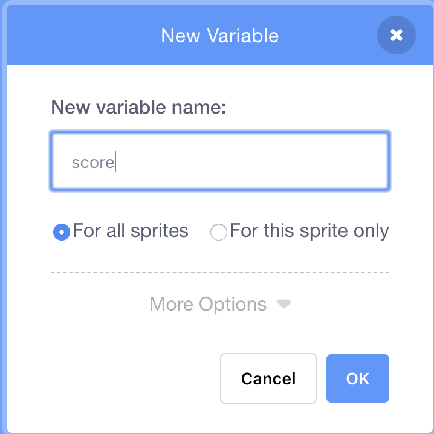
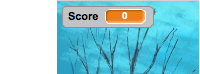
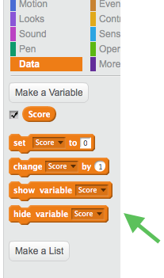

## Keeping score

To keep score, you’ll need somewhere to store the score, a way of adding to it, and a way of resetting it when the game is restarted.

+ First: storing it! Go to the **Data** blocks category and click **Make a Variable**.


+ Enter `Score` as the name. 



Check out your new variable and the blocks for it!





--- collapse ---
---
title: What are variables?
---

When you want to store information in a program, you use something called a **variable**. Think of it like a box with a label on it: you can put something in it, check what’s in it, and change what’s in it. You’ll find variables under **Data**, but you need to create them first! 

--- /collapse ---


Now you need to update the variable whenever a mosquito is eaten, and to reset it when the game is restarted. Those are both pretty easy:

+ From the **Data** section, take the `set Score to 0`{:class="blockdata"} and `change Score by 1`{:class="blockdata"} blocks and put them into your program: 

### Code for the parrot

```blocks
    when green flag clicked
    set [Score v] to [0]
    set rotation style [left-right v]
    go to x: (0) y: (0)
```

### Code for the mosquito

```blocks
    if <touching [Sprite1 v] ?> then
        change [Score v] by [1]
        hide
        wait (1) secs
        go to x: (pick random (-240) to (240)) y: (pick random (-180) to (180))
        show
    end
```

Cool! Now you’ve got a score and everything. 

+ Finally, and add this code to make the parrot introduce the game:

```blocks
    when green flag clicked
    set [Score v] to [0]
    set rotation style [left-right v]
    go to x: (0) y: (0)
    say [Hello! I need your help.] for (3) secs
    say [Can you help me catch of all the mosquitos? Use the arrow keys.] for (4) secs
    say [Mosquitos are small flies that spread dangerous diseases like malaria.] for (5) secs
    say [Please help me catch them and protect my friends!] for (3) secs
```

--- challenge ---

## Challenge: winning the game

+ Pick a score at which the player wins, and make something cool happen. Maybe the parrot congratulates them, or a "You win!" sprite appears, or music plays, or...you get the idea!

--- /challenge ---

