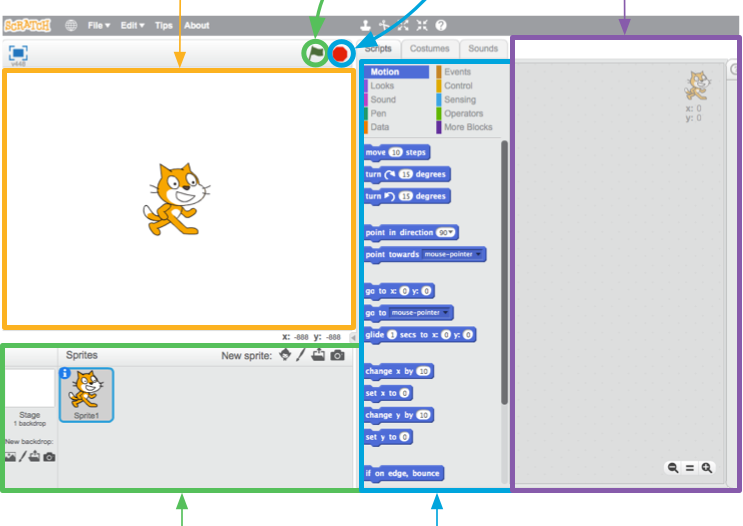

## Getting Setup

+ You’re going to need to have **Scratch**! You can either download it and install it on your computer by going to [dojo.soy/downloadscratch](dojo.soy/downloadscratch) or use it in your web browser by going to [dojo.soy/usescratch](dojo.soy/usescratch). Do one of these two and once you’re set up, move on to the next step.

Once you sign-in to the online Scratch, or load it on your computer, you’ll see a screen like the one below.

This screen has a few parts you’ll need to remember. They are highlighted in the picture below. 

   * Stage
   * Start Program
   * Stop Program
   * Current Sprite Panel
   * Sprite List
   * Code Blocks Palette

There are a few words from that picture that need explaining:

### The Stage

   This is where your Scratch Programs run. It has

   * One or more **backgrounds** \(images on the background of the screen\)
   * Any **code blocks** associated with it \(we’ll get to this\)
     **Sprites**

   Any object that goes on the stage is a sprite.  
   In Scratch, the sprite is:

   * The **image** on the stage
   * Any alternative **costumes** \(looks\) it has
   * Any **sounds** associated with it
   * Any **code blocks** associated with it 

   The **current sprite** is the one that's selected in the **sprite list**.

### Code Blocks

   Code in Scratch comes as blocks, that you click together to make programs. You choose blocks from the **code blocks palette** and drag them into the **current sprite panel**, then click them together.  
   There are 10 categories of blocks, which are colour coded, and you can select each category from the list at the top of the **code blocks palette**.

+ Time to get coding! Go back to Scratch and click on the Scratch Cat in the sprite list. The cat is now the current sprite.  
   
+ Go to the **Events** category in the **code blocks palette** and choose the `when [flag symbol] clicked`{:class="blockevents"} event, then drag it onto the **current sprite panel**.  

+ Then go to **Looks** in the **code blocks palette** and choose the `say [Hello!] for [2] secs`{:class="blocklooks"} block and drag it onto the **current sprite panel**, connecting it to the end of the other block, like this: 

+ Now click the **Start Program** button and watch what happens!

