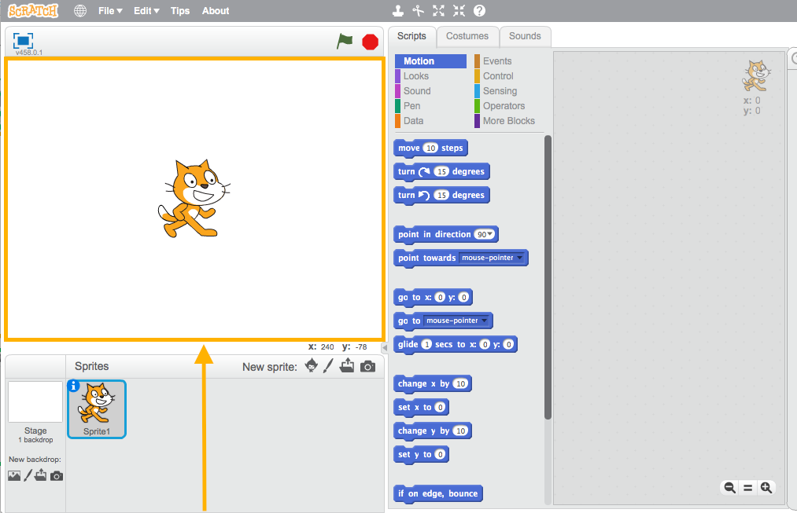
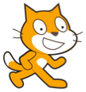
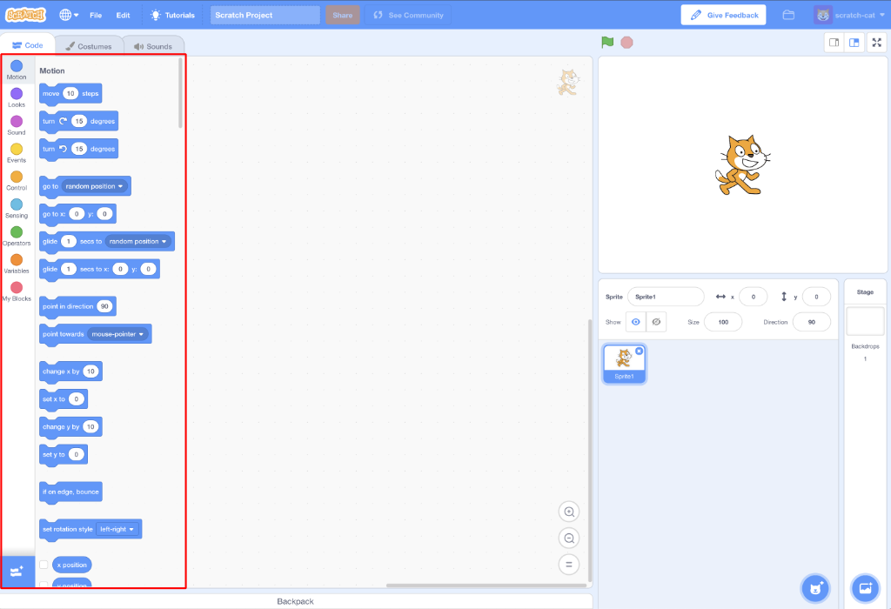
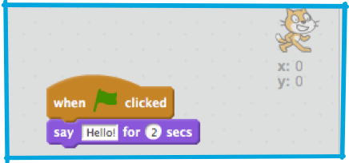

## Getting set up

Once you open Scratch, you’ll see a screen like the one below.

+ Look for each of the following parts and remember them.

### The Stage

 

--- collapse ---
---
title: What is the Stage?
---
This is where your Scratch programs run. It has:

* One or more **backgrounds** \(images on the background of the screen\)

* Any **code blocks** associated with it \(we’ll get to this\)

--- /collapse ---

### The sprite list

 

--- collapse ---
---
title: What is a sprite?
---

Any object that goes on the Stage is a **sprite**.  

The sprite includes:
* The **image** on the stage
* Any alternative **costumes** \(looks\) it has
* Any **sounds** associated with it
* Any **code blocks** associated with it 

--- /collapse ---

### The code blocks palette

 
 
--- collapse ---
---
title: Code blocks
---

Code in Scratch comes as blocks that you connect together to make programs. You choose blocks from the **code blocks palette** and drag them into the **current sprite panel**, then connect them.

There are ten categories of blocks. They are colour coded, and you can select each category from the list at the top of the **code blocks palette**.

--- /collapse ---

### The current sprite panel

 

--- collapse ---
---
title: What is the current sprite?
---

The **current sprite** is the one that's selected in the **sprite list**.

The **current sprite panel** is where you can see the code, costumes, and sounds for the selected sprite.

--- /collapse ---

+ Time to get coding! Go back to Scratch and click on the Scratch Cat in the sprite list. The cat is now the current sprite.  
   
+ Go to the **Events** category in the **code blocks palette**, click the `when flag clicked`{:class="blockevents"} block and drag it onto the **current sprite panel**.  

```blocks
    when green flag clicked
```

+ Then go to **Looks** in the **code blocks palette** and find the block

```blocks
    say [Hello!] for (2) secs
```
+ Drag it onto the **current sprite panel**, connecting it to the bottom of the other block, like this: 



+ Now click the **Start Program** button and watch what happens!
