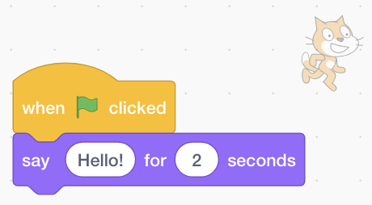

## Getting set up

Once you open Scratch, you’ll see a window like the one below.

+ Look for each of the following areas and remember where they are.

### The Stage

 

--- collapse ---
---
title: What is the Stage?
---
This is where your Scratch programs run. It has:

* One or more **backgrounds** \(images on the background of the screen\)

* Any **code blocks** associated with it \(we’ll get to this\)

--- /collapse ---

### The sprite list

 

--- collapse ---
---
title: What is a sprite?
---

Any item you can add on the Stage is a **sprite**.  

A sprite includes:
* The **image** on the Stage
* Any extra **costumes** \(looks\) it has
* Any **sounds** associated with it
* Any **code blocks** associated with it 

--- /collapse ---

### The code blocks palette

 
 
--- collapse ---
---
title: Code blocks
---

Code in Scratch comes in the form of blocks that you connect to make programs. You choose blocks from the **code blocks palette**, drag them into the **current sprite panel**, and then connect them to each other.

There are ten categories of blocks. They are colour-coded, and you can choose between them by clicking on the items in the list at the top of the **code blocks palette**.

--- /collapse ---

### The current sprite panel

 

--- collapse ---
---
title: What is the current sprite?
---

The **current sprite** is the one that's selected in the **sprite list**.

The **current sprite panel** is where you can see the code, costumes, and sounds for the selected sprite.

--- /collapse ---

Time to get coding!

+ In the sprite list, click on the Scratch Cat. The cat is now the current sprite.  
   
+ Choose the **Events** category in the code blocks palette, click the `when flag clicked`{:class="blockevents"} block, and drag it onto the current sprite panel.  

```blocks
    when green flag clicked
```

+ Then go to **Looks** in the code blocks palette and find this block:

```blocks
    say [Hello!] for (2) secs
```
+ Drag it onto the current sprite panel, connecting it to the bottom of the other block like this: 



+ Now click the **Start Program** button and watch what happens!
