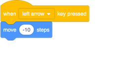
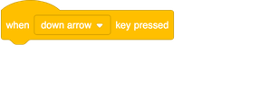
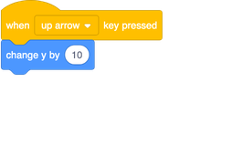
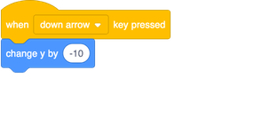
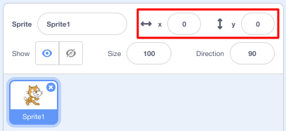

## Moving things around

Right now your shark moves in a circle, and it would be much more fun to control it with the arrow keys. On this card, you’re going learn how to do that!

+ Start by deleting all code that you have for the shark.

As you’ve probably guessed, you’re going to need **Event** and **Motion** blocks again! 

+ This time, look for this block and drag it into the current sprite panel:

+ Click the little arrow (▼) beside `space`. You will see a list of all your keyboard keys that you can pick from. 

You’re going to need four of the `when key pressed` blocks — one for each of your arrow keys. To make your shark move, you'll need to connect these blocks to **Motion** blocks like this: 

**Note**: `-10` means 'go back 10 steps'.

+ Add the blocks shown above to your program, and click the green flag to test out your code.

Now your shark moves back and forwards, which is pretty cool, but it doesn’t move up or down. Also, if you look through the **Motion** blocks, you’ll see there are no blocks for 'up' or 'down'. There are a whole bunch of them related to **x** and **y** coordinates though — let's try those!

+ Grab two `change y by`{:class="block3motion"} blocks, and update your code like this: 

Now when you press the arrows keys, the shark moves all over the stage!

--- collapse ---
---
title: How do x- and y-coordinates work?
---

To talk about the positions of objects, such as sprites, we often use x- and y-coordinates. The **x-axis** of the Stage coordinate system runs from **left to right**, and the **y-axis** runs from **bottom to top**. 

A sprite can be located by the coordinates of its centre, for example `(15, -27)`, where `15` is its position along the x-axis , and `-27` its position along the y-axis.

+ To get a feel for how this actually works, select a sprite and use the **x** and **y** controls to move it around the stage by setting different values for the coordinates.

+ Try different pairs of values to see where the sprite goes! In Scratch, the x-axis goes from `-240` to `240`, and the y-axis goes from `-180` to `180`.

--- /collapse ---

### Restarting the game

The shark moves all over the screen now, but imagine this is a game: how do you restart it, and what happens at the start of each game?

You need to get the shark to its original location when the player starts the game. They'll start this game by clicking on the green flag, so you need to change the shark sprite's x- and y-coordinates when that happens.

That’s actually pretty easy! The centre of the stage is `(0, 0)` in `(x, y)` coordinates. 

So all you need is an **Event** block for that green flag, and the **go to** block from **Motion**. 

+ Drag a `when green flag clicked`{:class="blockevent"} **Event** block onto the current sprite panel.

+ Then find the `go to`{:class="block3motion"} **Motion** block, and attach it to your flag **Event** block.

+ Set the both the `x` and the `y` coordinate to `0` in the `go to`{:class="block3motion"} block if they are not already `0`. 

+ Now click the green flag: you should see the shark return to the centre of the stage!
