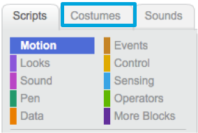
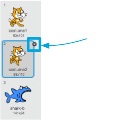

## Setting the scene

Scratch has a library of backgrounds and sprites for you to use to make your project look awesome.

+ Select the stage.

+ Click on **Backdrops**.

+ Click the icon to **Choose backdrop from library**. 

 
+ Then pick your favourite outdoor background! 

Great! Now let's turn the cat into a parrot!

+ First, select the cat and click on the **Costumes** tab.

+ Then, click on **Choose costume from Library** 

+ Select a parrot and click **OK**. 

+ Now remove the cat costumes by selecting each of them and clicking on the **x**.

Great! You have a parrot!
