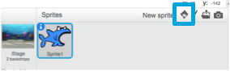

## All the sprites

Now you have a shark that you can move around using the arrow keys. Nice! Time to add some fish for it to catch.

+ Click the **New sprite** button, and on the screen that opens, choose a fish.



If your fish is a bit big compared to your shark, you can use the **grow** and **shrink** buttons to make both sprites the right size!


+ Click on **grow** or **shrink**, and then click on one of the sprites to make it bigger or smaller.

Great! Later, you're going to add some code to make the fish move around on its own, without help from the player. Your player will move the shark and try to catch the fish.

--- collapse ---
---
title: What about the backwards shark?
---

It does look a little funny to have that shark swimming backwards. Just like you’d usually turn around rather than walking backwards, the shark would turn around rather than swimming backwards. Luckily for you, Scratch has a block for this!

The `point in direction`{:class="blockmotion"} block lets you pick the direction your sprite is pointing in. You’ll find it in the **Motion** blocks section. You can type in any number, but the block comes with the four directions you'll need most: `up`, `down`, `left`, and `right`.

--- /collapse ---

+ Grab a couple of copies of the `point in direction`{:class="blockmotion"} block from the **Motion** list and connect them to your shark's code, like this: 

```blocks
    when [left arrow v] key pressed
    point in direction (-90)
    move (10) steps
```

```blocks
    when [right arrow v] key pressed
    point in direction (90)
    move (10) steps
```

+ Change the number of steps in the `move`{:class="blockmotion"} blocks from `-10` to `10`.

If you try moving the shark around now after you've added the `point in direction`{:class="blockmotion"} blocks, you might notice something a little strange happening. The shark may not be turning quite right! 


--- collapse ---
---
title: Why does it go upside down?
---

The problem here is that the shark sprite started, as all sprites do, with the 'all around' **rotation style**, and what you need it to have is the 'left-right' style.

As usual, there’s a block for that, and it’s in **Motion**! 

--- /collapse ---

+ Look in the **Motion** category for the block `set rotation style`{:class="blockmotion"}.

+ Add the block to your reset code from earlier, and set the rotation style to `left-right`, like this: 

```blocks
    when green flag clicked
    set rotation style [left-right v]
    go to x: (0) y: (0)
```
