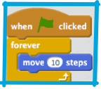
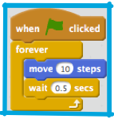
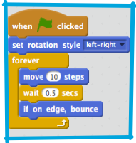
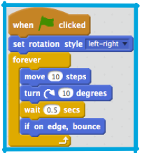
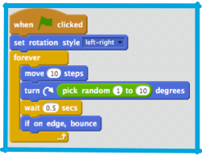

## Remote control fish

1Ok, now it's time to make the fish swim on its own. To do this, you’re going to need a new kind of block: a **control** block. These let you do things a certain number of times, or under certain conditions.

+ Select your fish sprite and drag a `“when green flag clicked”` **event** block, a `“forever”` **control** block and a `“move 10 steps”` **motion** block into the **sprite panel** like this: 

The fish does whatever is in the `“forever”` block over and over again, forever. Once it has reached the end it goes back to the top of the block and starts again. Now click the green flag and watch what happens!

Well, that fish just crashed into the side of the **stage**, and it was moving far too fast for your shark to catch. First, you need to slow it down. That’s actually pretty easy, you just need it to wait for a little while after it moves those 10 steps.

+ There’s a **control** block that can help you here: 

+ You can set how many **seconds** you want the fish to wait. For now, try half a second (0.5). You can test out different values later, to see which is the best for the game. Remember you can change the number of steps too! 

The fish moves now, but you need it to bounce off the edge too. 

+ Yet again, there’s a **motion** block for this! It’s the `“if touching edge bounce”` block. It checks if the sprite is touching the edge and, if it is, turns left, right, up or down as appropriate. Of course, this will lead to an upside-down fish, so you need `“set rotation style”` again. 

The fish moves back and forward now, but only in a straight line. That's going to be a bit too easy for the player to catch with the shark. You need to make the fish swim more unpredictably.

+ You already know from Card 2 how to make a sprite turn, so start there: Add a turn into the fish’s swimming and click the green flag. 

It’s better, but there’s still too much of a pattern. It needs to be more random. Luckily, Scratch can do random for you! You’ll just need a new kind of block, called an **operator** block.

**Operators** take in one or more values (numbers, text, true/false values) and give back a single value. You can tell the kind of value it will give back by the shape of the block: round ends give numbers or text, pointy ends give true/false. 

+ You need the `"pick random"` **operator** block, and you need to plug it into the `“turn degrees”` **motion** block by clicking and dragging it into the field where you set the number of degrees. You can change the minimum and maximum numbers it will pick, but the default values (1 and 10) are pretty good for this game, so you can just leave them.

+ Update the fish code to this and then run it by clicking the green flag: 

 
####Next: Catching that fish!

