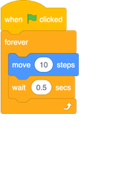

## Remote-control fish

Ok, now it's time to make the fish swim on its own. To do this, you’re going to need a new kind of block: a **Control** block. 

+ First, select your fish sprite!

+ Drag a `when green flag clicked`{:class="block3events"} **Event** block, a `forever`{:class="block3control"} **Control** block, and a `move 10 steps`{:class="block3motion"} **Motion** block into the **sprite panel**, like this: 

--- collapse ---
---
title: What does the new block do?
---

**Control** blocks make your program do things a certain number of times, or under certain conditions.

Here, the fish does whatever is inside the `forever`{:class="block3control"} block over and over again on a loop, forever. So once it has done the last thing (block) inside the `forever`{:class="block3control"} block, it starts over at the top and does everything again, and so on. 

--- /collapse ---

+ Now click the green flag and watch what happens!

Well, that fish just crashed into the side of the Stage, and it was moving far too fast for your shark to catch. 

First, you need to slow the fish down. That’s actually pretty easy, you just need it to wait for a little while after it moves those 10 steps. There’s a **Control** block that will help you here: 

+ Add the `wait`{:class="block3control"} block into your code inside the `forever`{:class="block3control"} block, and change the number to `0.5`, like this:

--- collapse ---
---
title: Making adjustments
---

The number you set in the `wait`{:class="block3control"} block says how many **seconds** you want the fish to wait. `0.5` is half a second. 

You can test out different values to see which is the best for the game. And remember that you can change the number of steps inside the `move`{:class="block3motion"} block too! 

--- /collapse ---

The fish moves now, but you need it to bounce off the edge of the Stage too. Yet again, there’s a **Motion** block for this! 

+ Find the `if on edge bounce`{:class="block3motion"} block, and add it in after the `wait`{:class="block3control"} block.

--- collapse ---
---
title: What does the new block do?
---

The `if on edge bounce`{:class="block3motion"} block checks if the sprite is touching the edge of the Stage and, if it is, it turns left, right, up, or down as appropriate. 

--- /collapse ---

Of course, this will lead to an upside-down fish, so you need a `set rotation style`{:class="block3motion"} block again. 

+ Update your code to set the rotation style of the fish to `left-right` at the beginning of the sprite's script:

The fish moves backwards and forwards now, but only in a straight line — a bit too easy for the player to catch with the shark! You need to make the fish less predictable.

You already know from a previous step how to make a sprite turn, so start there! 

+ Add a turn into the fish's swimming instructions, and click the green flag. 

It’s better, but there’s still too much of a pattern. It needs to be more random. Luckily, Scratch can do random for you! You’ll just need a new kind of block, called an **operator** block.

--- collapse ---
---
title: What's an operator?
---

**Operators** take in one or more values (like numbers, text, or `True/False` values) and give back a single value. You can tell the kind of value it will give back by the shape of the block: round ends give numbers or text, pointy ends give `True/False`. 

--- /collapse ---

+ Find the `pick random`{:class="block3operators"} **operator** block, and plug it into the `turn degrees`{:class="block3motion"} **Motion** block by clicking it and dragging it into the field where you set the number of degrees. 

**Note**: you can change the minimum and maximum numbers it will pick, but the default values (`1` and `10`) are pretty good for this game, so you can just leave them.

+ Then click the green flag to run the code!

--- collapse ---
---
title: So what does the forever block do now?
---

The forever block now makes the fish sprite do four things in order:
1. Move forward
1. Turn a little bit
1. Wait briefly
1. Check whether it's at the edge of the Stage

Once the sprite has done the check, it will start at the beginning of the loop again and move, turn, wait, check, for as long as you let your Scratch program run.
 
 --- /collapse ---
 
Cool! Next up: catching that fish!

