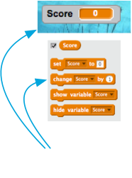

## Fishing!

The shark moves, the fish swims, but they don’t interact: If the fish swims right into the shark’s mouth, nothing happens. Time to change that!

First, you need to know if the fish is touching the shark. For this, you'll need a **control** block and a **sensing** block. **Sensing** blocks collect information, like where the sprite is, what it’s touching, etc.

+ The **control** block is an `if... then`{:class="blockcontrol"} block and needs to be given a true/false value. 

+ The **sensing** block you’re going to use is `touching...`{:class="blocksensing"} where you have to pick the sprite name (if you haven’t changed it, it'll be Sprite1). From those pointy ends, you can tell it’s going to give you the true/false value `if... then`{:class="blockcontrol"} needs.

+ You can add this into the `forever`{:class="blockcontrol"} loop on the fish, after the `if on edge bounce`{:class="blockmotion"}: 

```blocks
    if on edge, bounce
    if <touching [Sprite1 v] ?> then
    end
```

Of course, you’ve just added an `if... then`{:class="blockcontrol"} with no then. 

+ You can make the fish vanish, as if the shark ate it by using the `hide`{:class="blocklooks"} block you can find in **looks** inside the `if... then`{:class="blockcontrol"}. 

```blocks
    if <touching [Sprite1 v] ?> then
        hide
    end
```

Now once the shark catches the fish it disappears for good. That’s not great. 

+ Put the `show`{:class="blocklooks"} block, also from **looks** in at the very start of the fish code, so you can reset the game. 

```blocks
    when green flag clicked
    show
    set rotation style [left-right v]
    forever
```

Better, but you don’t want the player restarting every time they catch one fish! 

+ You can be clever here — when the fish is hidden, wait, move it, then show it again. It looks like lots of fish, but it’s that one sprite moving around! 

```blocks
    if on edge, bounce
    if <touching [Sprite1 v] ?> then
        hide
        wait (1) secs
        go to x: (pick random (-240) to (240)) y: (pick random (-180) to (180))
        show
    end
```

That’s a game! There’s no way to keep score, though... or to win. You can fix that too! To keep score, you’ll need somewhere to store the score, a way of adding to it and a way of resetting it when the game is restarted.

First: Storing it. When you want to store information in a program, you use something called a variable. Think of it like a box with a label on it: you can put something in it, check what’s in it and change what’s in it. You’ll find variables under **data**, but you need to create one first! 

+ Click **Make a Variable**.


+ Enter `Score` as the name. 


Check out your new variable and the blocks for it!



Now you need to update the variable whenever a fish is eaten, and to reset it when the game is restarted. Those are both pretty easy:

+ From the **data** section, take the `Set Score to 0`{:class="blockdata"} and `Change Score by 1`{:class="blockdata"} blocks and put them into your program: 


Cool! Now you’ve got a score and everything. 

+ Pick a score at which the player wins and make something cool happen! Maybe the shark congratulates them, or a "You Win" sprite appears, or music plays or... you get the idea!


