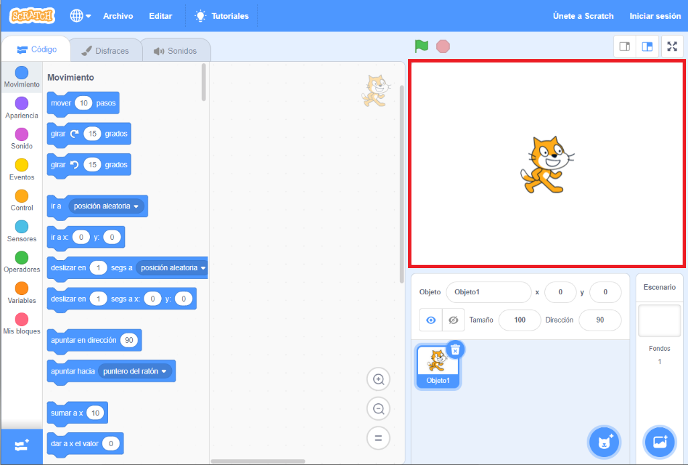
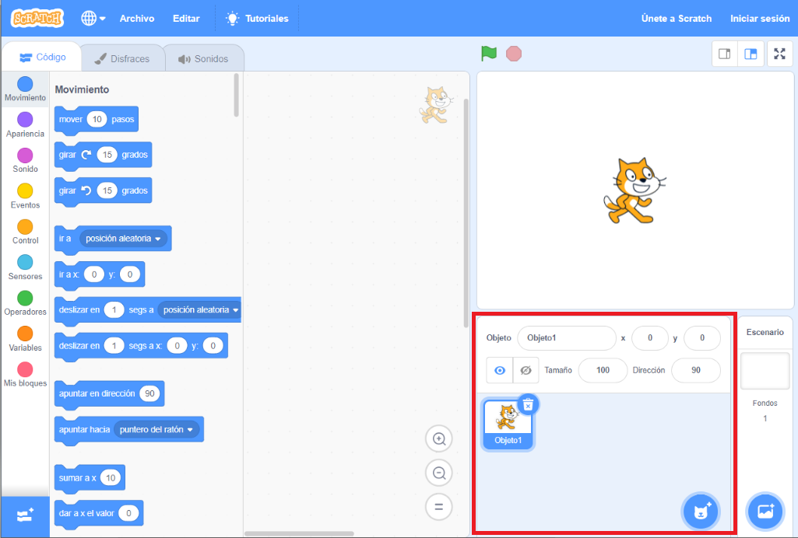
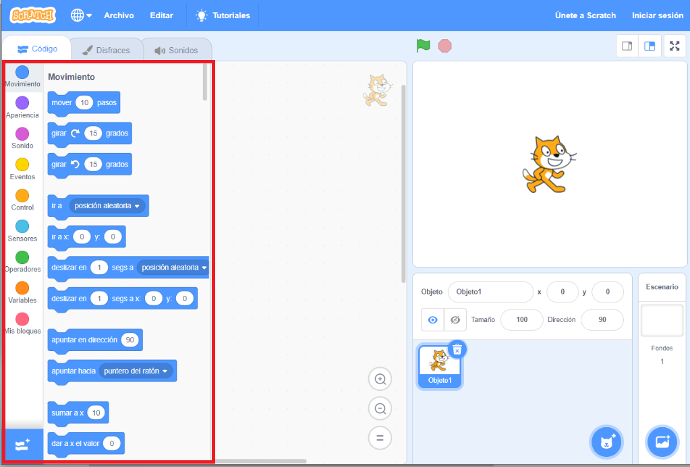
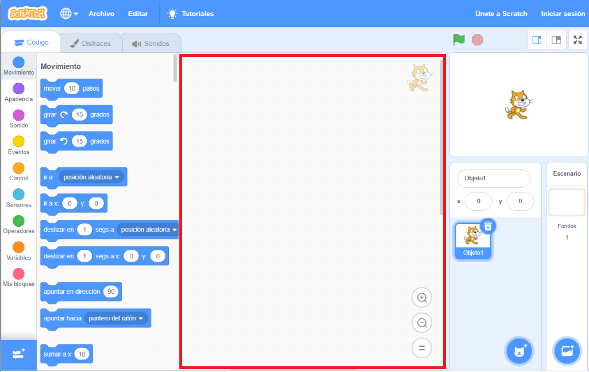
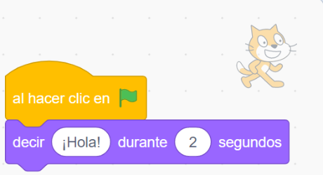

## Preparándote

Una vez que abras Scratch, verás una ventana como la de abajo.

\--- task \---

Busca cada una de las siguientes áreas y recuerda dónde están.

\--- /task \---

### El Escenario



## \--- collapse \---

## title: ¿Qué es el Escenario?

Aquí es donde se ejecutan tus programas de Scratch. Tiene:

* Uno o más **fondos** \(imágenes en el fondo de la pantalla\)

* Any **code blocks** associated with it \(we’ll get to this\)

\--- /collapse \---

### La lista de objetos



## \--- collapse \---

## title: ¿Qué es un objeto?

Cualquier elemento que puedas agregar al Escenario es un **objeto**.

Un objeto incluye:

* La **imagen** en el Escenario
* Any extra **costumes** \(looks\) it has
* Cualquier **sonido** asociado a él
* Cualquier **bloque de código** asociado a él 

\--- /collapse \---

### La paleta de bloques de código



## \--- collapse \---

## title: Bloques de código

Code in Scratch comes in the form of blocks that you connect to make programs. Solo tienes que elegir los bloques de la **paleta de bloques de código**, arrastrarlos al **panel del objeto actual**, y luego conectarlos entre sí.

Hay diez categorías de bloques. Están codificados por colores, y puedes elegir entre ellos haciendo clic en los elementos de la lista en la parte superior de la **paleta de bloques de código**.

\--- /collapse \---

### The current sprite panel



## \--- collapse \---

## title: What is the current sprite?

The **current sprite** is the one that's selected in the **sprite list**.

The **current sprite panel** is where you can see the code, costumes, and sounds for the selected sprite.

\--- /collapse \---

Time to get coding!

\--- task \---

In the sprite list, click on the Scratch Cat. The cat is now the current sprite.

Choose the **Events** category in the code blocks palette, click the `when flag clicked`{:class="block3events"} block, and drag it into the current sprite panel.

```blocks3
    when green flag clicked
```

\--- /task \---

\--- task \---

Then go to **Looks** in the code blocks palette and find this block:

```blocks3
    say [Hello!] for (2) secs
```

Click on it, hold down the mouse button, and then just drag it into the current sprite panel and let go of the button.

\--- /task \---

\--- task \---

Now that the second block is in the current sprite panel, connect it to the bottom of the first block by clicking and dragging it again to move it below the other block until they snap together, like this:



\--- /task \---

\--- task \---

Now click the **Start Program** button and watch what happens!

\--- /task \---