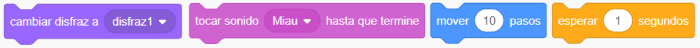
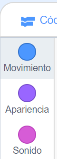
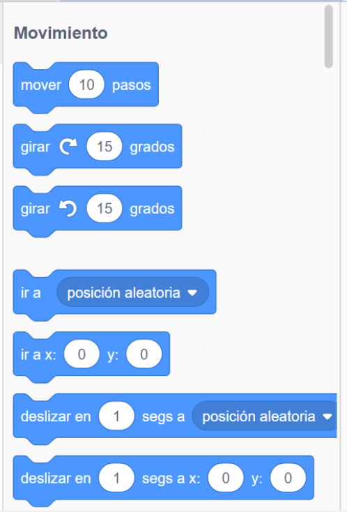
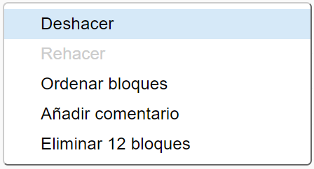

## Agregar y eliminar bloques de código

¡Genial! Has creado tu primer programa Scratch. ¡Es hora de aprender un poco más sobre cómo mover código dentro y fuera de Scratch! El código de Scratch se compone de **bloques** como estos:



Encontrarás todos los bloques en la **paleta de bloques de código**, ordenados en diferentes categorías de acuerdo con lo que hacen.

--- collapse ---
---
title: Utilizando bloques de las diferentes categorías
---

Haz clic en el nombre de una categoría para ver los bloques en esa categoría. Aquí, la categoría **Movimiento** está seleccionada:



Todos los bloques de la categoría en la que has hecho clic se muestran en una lista:



Puedes hacer clic en el bloque que desees, y luego arrastrarlo al panel del objeto actual y soltarlo. Una vez que esté en el panel, puedes moverlo y conectarlo a otros bloques.

--- /collapse ---

¡Si quieres ver lo que hace un bloque, puedes hacer doble clic en él para que se ejecute!

--- task ---

Intenta hacer doble clic en algunos de los bloques para ver qué hacen.

--- /task ---

--- collapse ---
---
title: Ejecutando el código
---

Por lo general, quieres que tu código se ejecute automáticamente cada vez que sucede algo específico. Esta es la razón por la que muchos de tus programas comenzarán con un bloque de la categoría **Eventos**, con mayor frecuencia este:

```blocks3
    al hacer clic en bandera verde
```

Los bloques de código conectados a este bloque se ejecutarán después de hacer clic en la **bandera verde**.

Los bloques de código se ejecutan de arriba a abajo, por lo que es importante el orden en el que se juntan los bloques. En este ejemplo, el objeto `dirá`{:class="block3looks"} `¡Hola!` antes de que se ejecute `{`: {= class = "block3sound"} el sonido `meow`.

```blocks3
    al hacer clic en bandera verde
    diga [¡Hola!]
    reproducir sonido [meow v]
```

--- /collapse ---

¡Eliminar los bloques de código que no quieras en tu programa es fácil! Simplemente arrástralos de nuevo a la paleta de bloques de código.

**Ten cuidado:** al arrastrarlos a la paleta de bloques de códigos, se eliminarán todos los bloques conectados al bloque que arrastres, así que asegúrate de separar los bloques de códigos que quieres conservar de los que deseas eliminar. Si eliminas algunos bloques de código por accidente y deseas recuperarlos, haz clic con el botón derecho y luego haz clic en la opción **deshacer** para recuperar todo.



--- task ---

¡Intenta agregar, eliminar y recuperar algunos bloques de código!

--- /task ---

### Recapitulemos

Ahora que sabes cómo mover bloques de código y hacer que pasen cosas, ¡es hora de que crees un programa para que el gato camine en un círculo!

--- task ---

Asegúrate de tener el sprite del gato seleccionado en la lista de sprites, y luego arrastra los siguientes bloques al panel de sprites y conéctalos. Los encontrarás en las listas **Eventos** y **Movimiento**.

```blocks3
    al hacer clic en bandera verde
    mover [10] pasos
```

--- /task ---

--- task ---

Ahora, haz clic en la bandera verde sobre el Escenario.


--- /task ---

Deberías ver al gato caminando en línea recta... esto no es exactamente lo que quieres, ¿verdad?

Nota: si haces clic en la bandera demasiadas veces y el gato se aleja, ¡puedes arrastrarlo hacia atrás!

--- task ---

Arrastra debajo el bloque girar para hacer que el gato sprite camine en círculo. Está en la lista **Movimiento** también.

```blocks3
    al hacer clic en bandera verde
    mover [10] pasos
+    girar a la derecha (15) grados
```

--- /task ---

--- collapse ---
---
title: ¿Cómo funciona el giro?
---

Este bloque hace que el objeto gire 15 grados de los 360 grados completos que componen un círculo. Puedes cambiar ese número y el número de pasos, haciendo clic en el número y escribiendo un nuevo valor.


--- /collapse ---

--- task ---

¡Ahora guarda tu trabajo!

--- /task ---