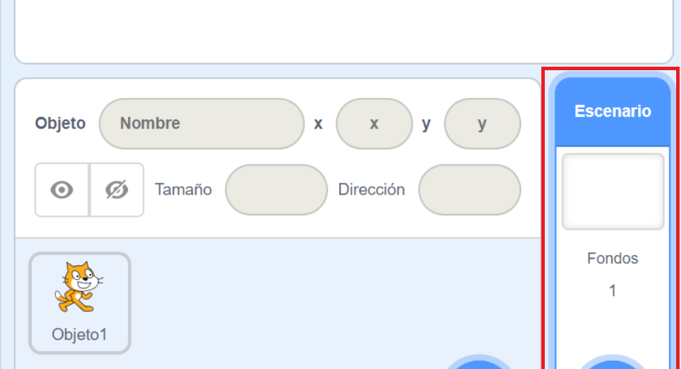
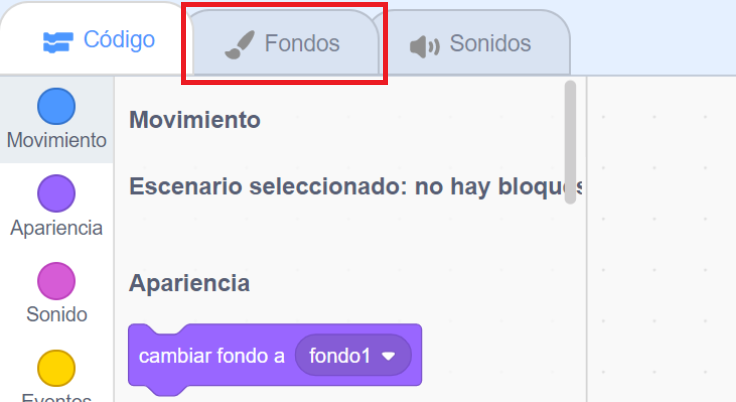
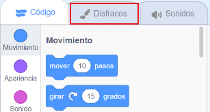
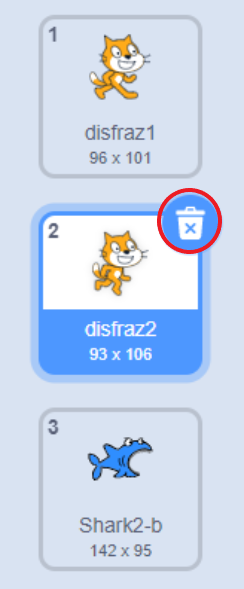

## Preparando la escena

Scratch tiene una biblioteca de fondos y objetos que puedes usar para hacer que tu proyecto se vea genial.

\--- task \---

Select the Stage.

Haz clic en **Escenario**.

Haz clic en **Elige un fondo**.

¡Luego elige tu fondo submarino favorito!

\--- /task \---

¡Genial! Aunque ahora tienes un gato bajo el agua, y los gatos no suelen ser grandes fans de esto. Pero puedes arreglarlo, ¡porque puedes convertir el gato en un tiburón!

\--- task \---

First, select the cat sprite and click on the **Costumes** tab.

Despues, haz clic en **Elegir un disfraz**

Seleccione esta imagen de tiburón y haz clic en **Aceptar**.

Ahora elimina los disfraces del gato seleccionando cada uno de ellos y haciendo clic en la **x**.

\--- /task \---

Ahora tienes un tiburón, ¡excelente!