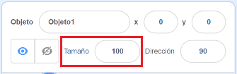
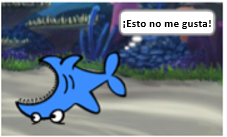

## Todos los objetos

Ahora tienes un tiburón que puedes mover usando las teclas de flecha. ¡Bien! Es hora de añadir algún pez para que lo pueda atrapar.

\--- task \---

Haz clic en el botón **Elige un objeto** y, en la ventana que se abre, elige un pez.


Si tu pez es un poco grande en comparación con tu tiburón, ¡puedes usar el control de tamaño para hacer que ambos objetos tengan el tamaño correcto!



Change the number in the size control to make the sprite bigger or smaller.

\--- /task \---

¡Genial! Más tarde, vas a añadir código para hacer que el pez se mueva por sí mismo, sin ayuda del jugador. Tu jugador moverá el tiburón y tratará de atrapar el pez.

## \--- collapse \---

## title: ¿Qué pasa con el tiburón nadando hacia atrás?

Parece un poco raro que el tiburón nade hacia atrás. Al igual que normalmente te das la vuelta en lugar de caminar hacia atrás, el tiburón debería girarse en lugar de nadar hacia atrás. Por suerte, ¡Scratch tiene un bloque para hacer esto!

El bloque `apuntar en dirección`{:class="block3motion"} te permite elegir la dirección en la que apunta tu objeto. Lo encontrarás en la sección de bloques **Movimiento**. Puedes escribir cualquier número de grados, para hacer que el sprite apunte a donde quieras.

\--- /collapse \---

\--- task \---

Arrastra un par de bloques `apuntar en dirección` {: class = "block3motion"} desde la lista **Movimiento** y conéctalos al código de tu tiburón, así:

```blocks3
    al presionar tecla [flecha izquierda v]
+     apuntar en dirección (-90)
    mover (10) pasos
```

```blocks3
    al presionar tecla [flecha derecha v]
+     apuntar en dirección (90)
    mover (10) pasos
```

\--- /task \---

\--- task \---

Cambia el número de pasos en los bloques `mover`{:class="block3motion"} de `-10` a `10`.

Si intentas mover el tiburón después de añadir los bloques `apuntar en dirección`{:class="block3motion"} notarás que sucede algo extraño. ¡Puede que el tiburón no esté girando bien!



\--- /task \---

## \--- collapse \---

## title: ¿Por qué nada al revés?

El problema está en que el objeto tiburón comenzó, como hacen todos los objetos, con el **estilo de rotación** 'en todas direcciones', y lo que necesitas es el estilo 'izquierda-derecha'.

Como de costumbre, hay un bloque para eso, ¡y está en la categoría **Movimiento**!

\--- /collapse \---

\--- task \---

Busca en la categoría **Movimiento** el bloque `fijar estilo de rotación a` {:class="block3motion"}.

Añade el bloque a tu código de inicio del tiburon, y establece el estilo de rotación a `izquierda-derecha`{:class="block3motion"}, así:

```blocks3
    al hacer clic en bandera verde
+     fijar estilo de rotación a [izquierda-derecha v]
    ir a x: (0) y: (0)
```

\--- /task \---