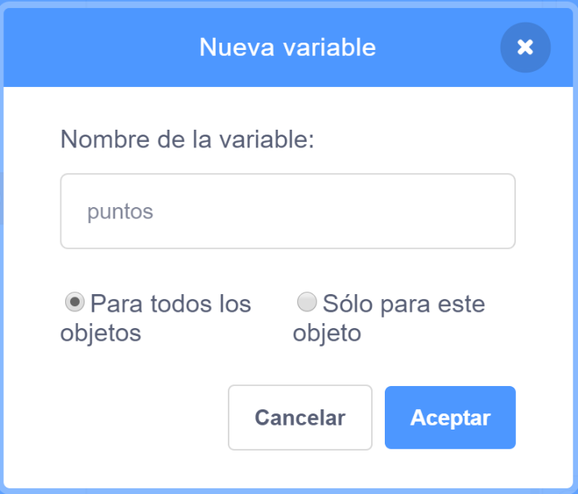

## Guardando la puntuación

Para anotar cuántos peces atrapa el jugador, necesitarás un lugar para almacenar la puntuación, una forma de sumarla y una forma de restablecerla cuando se reinicie el juego.

Primero: ¡guardando la puntuación!

--- task ---

Ve a la categoría de bloques **Variables** y haz clic en **Crear una variable**.


Introduce `puntos` como nombre.



¡Echa un vistazo a tu nueva variable!


--- /task ---

--- collapse ---
---
title: ¿Qué son las variables?
---

Cuando quieres almacenar información en un programa, se usa algo llamado **variable**. Piensa en ello como una caja con una etiqueta: puedes poner algo en ella, comprobar qué hay en ella y cambiar lo que hay en ella. Encontrarás variables en la sección **Variables**, ¡pero debes crearlas primero para que aparezcan allí!

--- /collapse ---

Ahora debes actualizar la variable cada vez que el tiburón se come un pez y restablecerla cuando se reinicia el juego. Hacer ambas cosas es bastante fácil:

--- task ---

Coje los bloques `dar a [mi variable v] el valor [0]`{:class="block3variables"} y `sumar a [mi variable v] [1]`{:class="block3variables"} de la sección **Variables**. Haz clic en las flechas pequeñas de los bloques, elije `puntos` de la lista, y luego añade los bloques a tu código:

### Código para el tiburón

```blocks3
    al hacer clic en bandera verde
+     fijar [puntos v] a [0]
    fijar estilo de rotación a [izquierda-derecha v]
    ir a x: (0) y: (0)
```

### Código para el pez

```blocks3
    si <¿tocando [Sprite1 v] ?> entonces
+        sumar a [puntos v] [1]
        esconder
        esperar (1) segundos
        ir a x: (número aleatorio entre (-240) y (240)) y: (número aleatorio entre (-180) y (180))
        mostrar
    end
```

--- /task ---

¡Genial! Ahora tienes puntuación y todo.