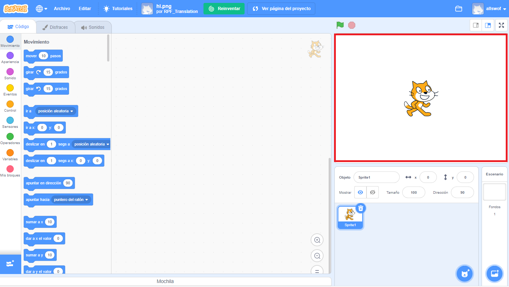
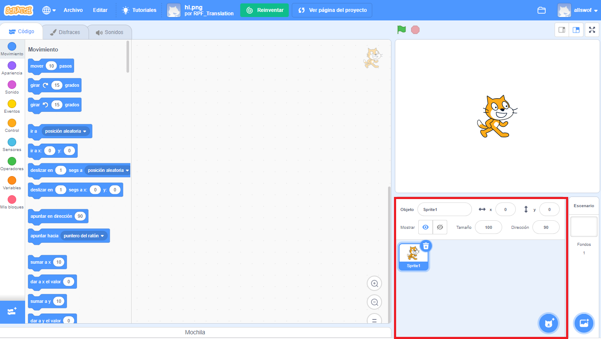
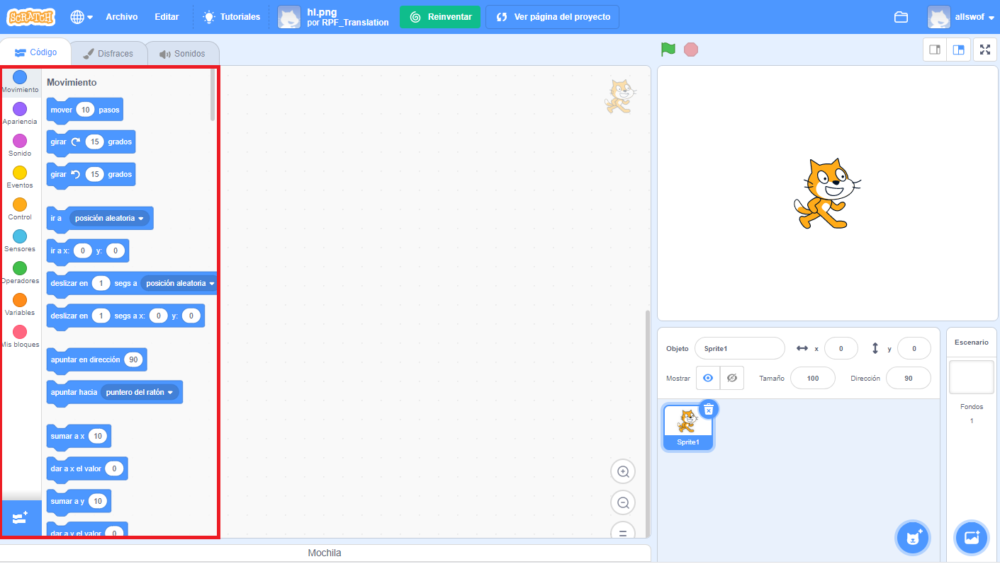
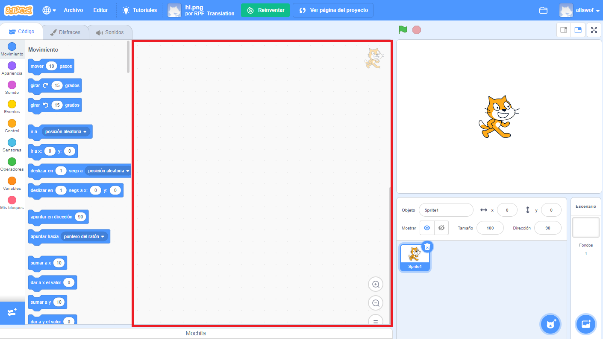
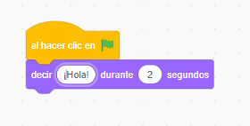

## Preparación

Una vez que abras Scratch, verás una ventana como la de abajo.

\--- task \---

Busca cada una de las siguientes áreas y recuerda dónde están.

\--- /task \---

### El Escenario



## \--- collapse \---

## titulo: ¿Qué es el Escenario?

Aquí es donde se ejecutan tus programas de Scratch. Tiene:

* Uno o más **fondos** \(imágenes en el fondo de la pantalla\)

* Cualquier **bloque de código** asociado a él \(ya llegaremos a esto\)

\--- /collapse \---

### La lista de objetos



## \--- collapse \---

## titulo: ¿Qué es un objeto?

Cualquier elemento que puedas agregar al Escenario es un **sprite**.

Un objeto incluye:

* La **imagen** en el Escenario
* Cualquier **disfraz** \(Apariencia\) extra que tenga
* Cualquier **sonido** asociado a él
* Cualquier **bloque de código** asociado a él 

\--- /collapse \---

### La paleta de bloques de código



## \--- collapse \---

## titulo: Bloques de código

El código en Scratch viene en forma de bloques que tú conectas para crear programas. Solo tienes que elegir los bloques de la **paleta de bloques de código**, arrastrarlos al **panel del objeto actual**, y luego conectarlos entre sí.

Hay diez categorías de bloques. Están codificados por colores, y puedes elegir entre ellos haciendo clic en los elementos de la lista en la parte superior de la **paleta de bloques de código**.

\--- /collapse \---

### El panel del objeto actual



## \--- collapse \---

## titulo: ¿Qué es el objeto actual?

El **objeto actual** es el que está seleccionado en la **lista de objetos**.

El **panel de objeto actual** es donde puedes ver el código, disfraces y sonidos para el objeto seleccionado.

\--- /collapse \---

¡Es hora de empezar a programar!

\--- task \---

En la lista de objetos, haz clic en el gato de Scratch. Ahora el gato es el objeto seleccionado.

Elige la categoría **Eventos** en la paleta de bloques de código, haz clic en el bloque `al hacer clic en bandera verde`{:class="block3events"}, y arrástralo al panel del objeto actual.

```blocks3
    when green flag clicked
```

\--- /task \---

\--- task \---

Luego ve a **Apariencia** en la paleta de bloques de códigos y encuentra este bloque:

```blocks3
    say [Hello!] for (2) secs
```

Haz clic sobre él, mantén presionado el botón del mouse y, a continuación, simplemente arrástralo al panel del objeto actual y suelta el botón.

\--- /task \---

\--- task \---

Ahora que el segundo bloque está en el panel del objeto actual, conéctalo a la parte inferior del primer bloque haciendo clic y arrastrándolo de nuevo para moverlo por debajo del otro bloque hasta que se junten así:



\--- /task \---

\--- task \---

Now click the **Green Flag** to start your program and watch what happens!

\--- /task \---