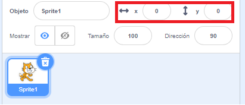

## Moviendo las cosas alrededor

Ahora mismo, tu tiburón se mueve en un círculo, pero sería mucho más divertido controlarlo con las teclas de flecha. Con esta tarjeta, ¡aprenderás a hacerlo!

--- task ---

Empieza eliminando todo el código que tienes para el tiburón.

--- /task ---

Como probablemente habrás adivinado, ¡necesitarás bloques de **Evento** y **Movimiento** otra vez!

--- task ---

Esta vez, busca este bloque y arrástralo en el panel de objetos actual:

```blocks3
    when [space v] key pressed
```

Haz clic en la flecha pequeña (▼) al lado de `espacio`. Verás una lista de todas las teclas del teclado que puedes elegir.

--- /task ---

Necesitarás cuatro de los bloques `al presionar tecla`{:class="block3events"} - uno por cada una de las teclas de flecha.

--- task ---

Para hacer que tu tiburón se mueva, conecta estos bloques a bloques de **Movimiento** como este:

```blocks3
    when [left arrow v] key pressed
    move (-10) steps
```

```blocks3
    when [right arrow v] key pressed
    move (10) steps
```

```blocks3
    when [up arrow v] key pressed
```

```blocks3
    when [down arrow v] key pressed
```

--- /task ---

**Nota**: `-10` significa 'ir atrás 10 pasos'.

--- task ---

Ahora haz clic en la bandera verde para probar tu código.

--- /task ---

Ahora tu tiburón se mueve hacia atrás y hacia adelante, lo que está bastante bien, pero no se mueve hacia arriba o hacia abajo. Además, si buscas en los bloques **Movimiento**, verás que no hay bloques de 'arriba' o 'abajo'. Pero si que hay un montón de ellos relacionados con las coordenadas **x** y **y** - ¡vamos a probarlos!

--- task ---

Coge dos bloques `cambiar y en`{:class="block3motion"}, y actualiza tu código así:

```blocks3
    when [up arrow v] key pressed
+     change y by (10)
```

```blocks3
    when [down arrow v] key pressed
+     change y by (-10)
```

--- /task ---

Ahora, cuando pulsas las teclas de flechas, ¡el tiburón se mueve por todo el escenario!

--- collapse ---
---
title: ¿Cómo funcionan las coordenadas x e y?
---

Para hablar sobre las posiciones de los objetos, como los sprites, a menudo usamos las coordenadas x e y. El eje de coordenadas **x** del Escenario va de **izquierda a derecha**, y el eje de coordenadas **y** va de **abajo hacia arriba**.


Un objeto se puede localizar por las coordenadas de su centro, por ejemplo `(15, -27)`, donde `15` es su posición a lo largo del eje x , y `-27` su posición a lo largo del eje y.

+ Para tener una idea de cómo funciona esto, selecciona un sprite y usa los controles **x** e **y** para moverlo por el escenario dando diferentes valores a las coordenadas.



+ ¡Prueba diferentes pares de valores para ver dónde va el objeto! En Scratch, el eje x va de `-240` a `240`, y el eje y va de `-180` a `180`.

--- /collapse ---

### Reiniciando el juego

Ahora el tiburón se mueve por toda la pantalla, pero imagina que se trata de un juego: ¿cómo lo reinicias y qué sucede al comienzo de cada juego?

Necesitas conseguir que el tiburón vaya a su posición original cuando el jugador inicie el juego. El juego se inicia al hacer clic en la bandera verde, así que debes cambiar las coordenadas x e y del objeto de tiburón cuando esto ocurra.

¡Hacer esto es muy fácil! El centro del escenario es `(0, 0)` en coordenadas `(x, y)`.

Así que todo lo que necesitas es un bloque **Eventos** para esa bandera verde, y el bloque **ir a** de la categoría **Movimiento**.

--- task ---

Arrastra un bloque `al hacer clic en bandera verde`{:class="block3events"} de la categoría **Eventos** al panel de objeto actual.

```blocks3
    when green flag clicked
```

Luego encuentra el bloque `ir a`{:class="block3motion"} en la categoría **Movimiento**, y arrástralo debajo del bloque de la bandera de la categoría **Eventos**.

```blocks3
    when green flag clicked
+     go to x: (0) y: (0)
```

Establece las coordenadas `x` e `y` en `0` en el bloque `ir a`{:class="block3motion"} si su valor actual no es `0`.

--- /task ---

--- task ---

Ahora haz clic en la bandera verde: ¡deberías ver al tiburón regresar al centro del escenario!

--- /task ---