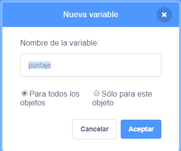

## Guardando la puntuación

Para anotar cuántos peces atrapa el jugador, necesitarás un lugar para almacenar la puntuación, una forma de sumarla y una forma de restablecerla cuando se reinicie el juego.

Primero: ¡guardando la puntuación!

\--- task \---

Ve a la categoría de bloques **Variables** y haz clic en **Crear una variable**.


Introduce `puntaje` como nombre.



¡Echa un vistazo a tu nueva variable!


\--- /task \---

## \--- collapse \---

## title: ¿Qué son las variables?

Cuando quieres almacenar información en un programa, se usa algo llamado **variable**. Piensa en ello como una caja con una etiqueta: puedes poner algo en ella, comprobar qué hay en ella y cambiar lo que hay en ella. Encontrarás variables en la sección **Variables**, ¡pero debes crearlas primero para que aparezcan allí!

\--- /collapse \---

Ahora debes actualizar la variable cada vez que el tiburón se come un pez y restablecerla cuando se reinicia el juego. Hacer ambas cosas es bastante fácil:

\--- task \---

De la sección ** variables **, toma el ` conjunto [mi variable v] a [0]` {: class = "block3variables"} y ` cambia [mi variable v] por [1]` {: class = "block3variables"} bloques. Haz clic en las flechas pequeñas de los bloques, elije `puntaje` de la lista, y luego añade los bloques a tu código:

### Código para el tiburón

```blocks3
    when green flag clicked
+    set [score v] to [0]
    set rotation style [left-right v]
    go to x: (0) y: (0)
```

### Código para el pez

```blocks3
    if <touching [Sprite1 v] ?> then
+        change [score v] by [1]
        hide
        wait (1) secs
        go to x: (pick random (-240) to (240)) y: (pick random (-180) to (180))
        show
    end
```

\--- /task \---

¡Genial! Ahora tienes puntuación y todo.