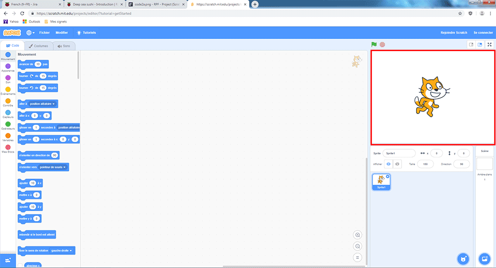
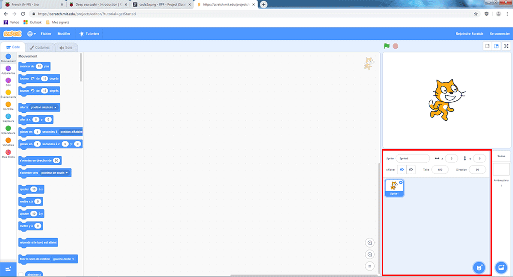
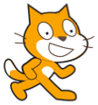
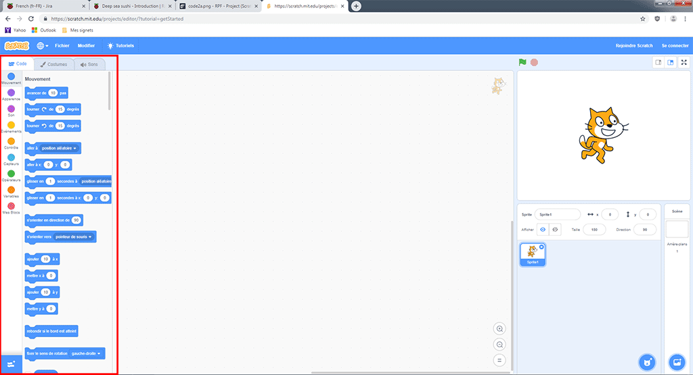
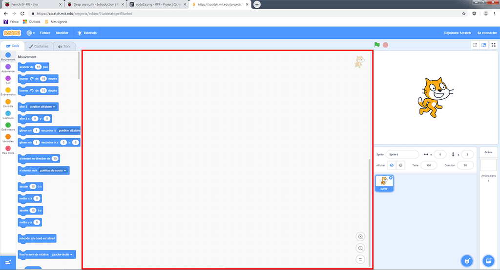
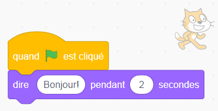

## Mise en place

Une fois que tu ouvres Scratch, tu verras une fenêtre semblable à celle ci-dessous.

\--- task \--- Recherche chacune des zones suivantes et rappelle-toi où elles se trouvent. \--- /task \---

### La scène



## \--- collapse \---

## title: Qu'est-ce que la scène?

C’est là que tes programmes Scratch sont exécutés. Il y a:

* Un ou plusieurs **arrière-plans** \(images sur le fond de l'écran\)

* Tous les **blocs de code** qui y sont associés \(nous y reviendrons\)

\--- /collapse \---

### La liste des sprites



## \--- collapse \---

## title: Qu'est-ce qu'un sprite?

Tout élément que tu peux ajouter sur la scène est un **sprite**.

Un sprite comprend:

* L' **image** sur la scène
* Tout **costume** \(apparence\) supplémentaire qu'il a
* Tous les **sons** qui y sont associés
* Tous les **blocs de code** qui y sont associés 

\--- /collapse \---

### La palette des blocs de code



## \--- collapse \---

## title: Blocs de code

Le code dans Scratch se présente sous la forme de blocs que tu relies pour créer des programmes. Tu choisis des blocs dans la **palette de blocs de code**, puis tu les fais glisser dans le **panneau du sprite actuel**, puis tu les relies les uns aux autres.

Il existe dix catégories de blocs. Ils sont codés par couleur, et tu peux choisir entre eux en cliquant sur les éléments dans la liste tout en haut de la **palette des blocs de code**.

\--- /collapse \---

### Le panneau du sprite actuel



## \--- collapse \---

## title: Qu'est-ce que le sprite actuel?

Le **sprite actuel** est celui qui est sélectionné dans la **liste des sprites** .

Le **panneau du sprite actuel** te permet de voir le code, les costumes, et les sons du sprite sélectionné.

\--- /collapse \---

Il est temps de coder!

\--- task \--- Dans la liste des sprites, cliquez sur le sprite du Chat Scratch. Le chat est maintenant le sprite actuel.

Choisis la catégorie **Événements** dans la palette des blocs de code, clique sur le bloc `quand le drapeau vert est cliqué`{:class="block3events"}, et fais-le glisser dans le panneau du sprite actuel.

```blocks3
    quand le drapeau vert est cliqué
```

\--- /task \---

\--- task \--- Ensuite, va à **Apparence** dans la palette des blocs de code et trouve ce bloc:

```blocks3
    dire [Bonjour!] pendant (2) secondes
```

Clique sur le bloc, maintiens le bouton de la souris enfoncé, fais glisser le bloc dans le panneau du sprite actuel, et relâche le bouton.

\--- /task \---

\--- task \--- Now that the second block is in the current sprite panel, connect it to the bottom of the first block by clicking and dragging it again to move it below the other block until they snap together, like this:

 \--- /task \---

\--- task \--- Now click the **Start Program** button and watch what happens! \--- /task \---