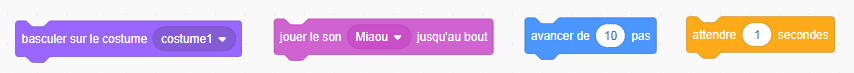
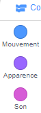
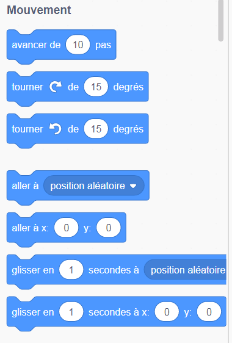
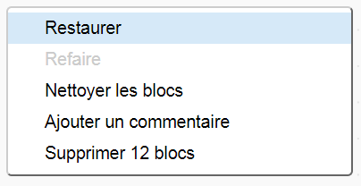

## Ajout et suppression de blocs de code

Génial! Tu as écrit ton tout premier programme Scratch. Il est temps d'en apprendre un peu plus sur l'introduction et la suppression de code dans Scratch! Le code Scratch est composé de **blocs** tels que:



Tu trouveras tous les blocs dans la **palette des blocs de code**, classés en différentes catégories en fonction de ce qu'ils font.

## \--- collapse \---

## title: Utilisation de blocs de différentes catégories

Clique sur un nom de catégorie pour voir les blocs de cette catégorie. Ici, la catégorie **Mouvement** est sélectionnée:



Tous les blocs de la catégorie sur laquelle tu as cliqué sont affichés dans une liste:



Tu peux cliquer sur le bloc que tu cherches, puis le faire glisser dans le panneau du sprite actuel, puis lâcher le bouton de la souris. Une fois que le bloc est dans le panneau, tu peux le déplacer et le relier à d'autres blocs.

\--- /collapse \---

Si tu veux voir ce que fait un bloc, tu peux double-cliquer dessus pour le faire exécuter!

\--- task \---

Try double-clicking on some of the blocks to see what they do.

\--- /task \---

## \--- collapse \---

## title: Exécuter le code

Usually, you want your code to run automatically whenever something specific happens. This is why many of your programs will start with a block from the **Events** category, most often this one:

```blocks3
    quand le drapeau vert est cliqué
```

The code blocks connected to this block will run after the **green flag** is clicked.

Code blocks run from top to bottom, so the order in which you snap your blocks together matters. In this example, the sprite will `say`{:class="block3looks"} `Hello!` before it will `play`{:class="block3sound"} the `meow` sound.

```blocks3
    quand le drapeau vert est cliqué
    dire [Bonjour]
    jouer le son [Meow v]
```

\--- /collapse \---

Removing or deleting code blocks you don’t want in your program is easy! Just drag them back into the code blocks palette.

**Be careful:** dragging them into the code blocks pallette will delete all the blocks connected to the block you drag, so make sure to separate code blocks you want to keep from those you want to remove. If you delete some code blocks by accident and want to get them back, right-click and then click on the **undo** option to get everything back.



\--- task \---

Try adding, deleting, and undeleting some code blocks!

\--- /task \---

### Les mettre tous ensemble

Now you know how to move code around and make things happen, it's time for you to create a program to make the Scratch Cat walk in a circle!

\--- task \---

Make sure you have the cat sprite selected in the sprite list, and then drag the following blocks into the sprite panel and connect them. You’ll find them in the **Events** and **Motion** lists.

```blocks3
    quand le drapeau vert est cliqué
    avancer de [10] pas
```

\--- /task \---

\--- task \---

Now, click on the green flag above the Stage.


\--- /task \---

You should see the cat walking in a straight line...not exactly what you want, right?

Remarque: si tu cliques trop souvent sur le drapeau et que le chat s'éloigne, tu peux le faire glisser !

\--- task \---

Snap the turn block to the end to make the cat sprite walk in a circle. It’s in the **Motion** list too.

```blocks3
    lorsque le drapeau vert est cliqué 
    déplacez de [10] pas
+ tournez cw (15) degrés
```

\--- /task \---

## \--- collapse \---

## title: Comment fonctionne la rotation?

This block makes the sprite turn 15 degrees of the full 360 degrees that make up a circle. You can change that number, and the number of steps, by clicking on the number and typing in a new value.


\--- /collapse \---

\--- task \---

Now save your work!

\--- /task \---