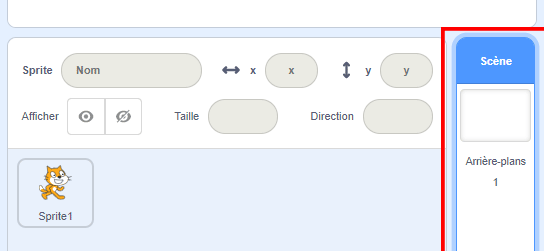
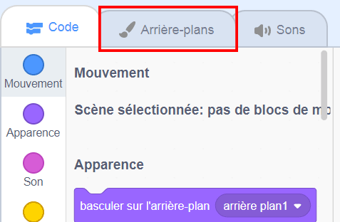
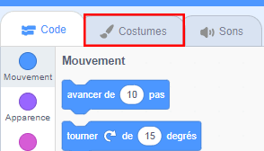
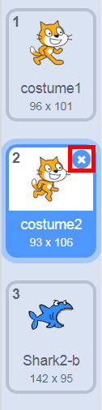

## Mise en scène

Scratch dispose d'une bibliothèque d'arrière-plans et de sprites que tu peux utiliser pour rendre ton projet superbe.

\--- task \---

Sélectionne la scène.

Clique sur **Arrière-plans**.

Clique sur l'icône **Choisir l'arrière-plan à partir de la bibliothèque**.

Ensuite, choisis ton fond sous-marin préféré !

\--- /task \---

Génial ! Bien sûr, tu as maintenant un chat sous l'eau, les chats ne sont généralement pas de grands fans de cela. Mais tu peux y remédier, car tu peux transformer le chat en requin !

\--- task \---

Tout d'abord, sélectionne le sprite chat et clique sur l'onglet **Costumes**.

Ensuite, clique sur **Choisir costume à partir de la bibliothèque**

Sélectionne cette image de requin et clique sur **OK**.

Enlève maintenant les costumes de chat en les sélectionnant chacun et en cliquant sur le **x**.

\--- /task \---

Maintenant tu as un requin - excellent !