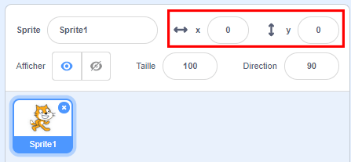

## Déplacer des objets

À l'heure actuelle, ton requin se déplace en cercle et il serait bien plus amusant de le contrôler avec les touches fléchées. Sur cette carte, tu vas apprendre à faire ça!

\--- task \---

Commence par supprimer tout le code que tu as pour le requin.

\--- /task \---

Comme tu l'as probablement deviné, tu auras encore besoin de blocs **Événements** et **Mouvement** !

\--- task \---

Cette fois, recherche ce bloc et fais-le glisser dans le panneau de sprite actuel :

```blocks3
    quand la touche [espace] est pressée
```

Clique sur la petite flèche (▼) à côté de `espace`. Tu verras une liste de toutes tes touches du clavier que tu peux choisir.

\--- /task \---

Tu auras besoin de quatre blocs `lorsque tu appuieras sur la touche`{:class="block3events"} - un pour chacune de tes touches de direction.

\--- task \---

Pour que ton requin bouge, connecte ces blocs au blocs **Mouvement** comme ceci :

```blocks3
    lorsque la touche [flèche gauche v] est enfoncée
    déplacer de (-10) pas
```

```blocks3
    lorsque la touche [flèche droite v] est enfoncée
    déplacer de (10) pas
```

```blocks3
    lorsque la touche [flèche haut v] est enfoncée
```

```blocks3
    lorsque la touche [flèche bas v] est enfoncée
```

\--- /task \---

**Remarque**: `-10` signifie « recule de 10 pas ».

\--- task \---

Maintenant, clique sur les flèches haut et bas pour tester ton code.

\--- /task \---

Maintenant, ton requin avance et recule, ce qui est plutôt cool, mais il ne se déplace pas en haut ou en bas. De plus, si tu regardes à travers les blocs **Mouvement** , tu verras qu'il n'y a pas de bloc pour « haut » ou « bas ». Il y a tout un tas d’entre elles liées aux coordonnées **x** et **y** - essayons-les !

\--- task \---

Récupère deux blocs `changer y par`{:class="block3motion"} et mets à jour ton code comme ceci :

```blocks3
    quand la touche [flèche haut v] est enfoncée
+ changer y par (10)
```

```blocks3
    quand la touche [flèche bas v] est enfoncée
+ changer y par (-10)
```

\--- /task \---

Maintenant, lorsque tu appuies sur les touches fléchées, le requin se déplace tout autour de la scène !

## \--- collapse \---

## title: Comment fonctionnent les coordonnées x et y?

Pour parler de la position des objets, tels que les sprites, nous utilisons souvent les coordonnées x et y. L' **axe des x** du système de coordonnées de la scène va de **gauche à droite**, et l' **axe des y** va de **bas en haut**.


Un sprite peut être repéré par les coordonnées de son centre, par exemple `(15, -27)`, où `15` est sa position sur l'axe des x et `-27` son axe des y.

+ Pour avoir une idée de la façon dont cela fonctionne réellement, sélectionne un sprite et utilise les commandes **x** et **y** pour le déplacer sur la scène en définissant différentes valeurs pour les coordonnées.



+ Essaie différentes paires de valeurs pour voir où va le sprite! Dans Scratch, l'axe des x va de `-240` à `240`, et l'axe y va de `-180` à `180`.

\--- /collapse \---

### Redémarrer le jeu

Le requin bouge maintenant sur tout l'écran, mais imagine qu'il s'agisse d'un jeu: comment le redémarrer et que se passe-t-il au début de chaque jeu ?

Tu dois amener le requin à son emplacement d'origine lorsque le joueur commence la partie. Il commencera ce jeu en cliquant sur le drapeau vert. Tu devras donc changer les coordonnées x et y du sprite du requin lorsque cela se produira.

C'est en fait assez facile ! Le centre de la scène est `(0, 0)` en `(x, y)` coordonnées.

Donc, tout ce dont tu as besoin est un bloc **Événement** pour ce drapeau vert, et le bloc **aller à** de **Mouvement**.

\--- task \---

Fais glisser un bloc `lorsque le drapeau vert est cliqué`{:class="block3events"} **Événement** sur le panneau sprite actuel.

```blocks3
    lorsque le drapeau vert est cliqué
```

Recherche ensuite le bloc `aller à`{:class="block3motion"} **Mouvement** et associe-le au bloc drapeau **Événement**.

```blocks3
    lorsque le drapeau vert est cliqué
+ aller à x: (0) y: (0)
```

Définis les coordonnées `x` et `y` sur `0` dans le bloc `aller à`{:class="block3motion"} si elles ne sont pas déjà `0`.

\--- /task \---

\--- task \---

Maintenant, clique sur le drapeau vert : tu devrais voir le requin revenir au centre de la scène !

\--- /task \---