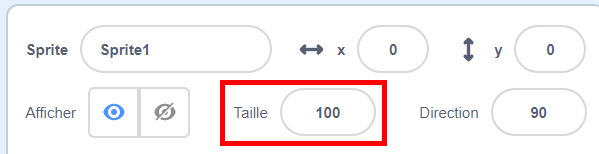
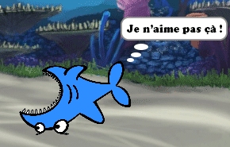

## Tous les sprites

Tu as maintenant un requin que tu peux déplacer avec les touches fléchées. Super! Il est temps d'ajouter du poisson à attraper.

\--- task \---

Clique sur le bouton **Nouveau sprite** et, sur l'écran qui s'ouvre, choisis un poisson.


Si ton poisson est un peu gros par rapport à ton requin, tu peux utiliser le contrôle de taille pour que les deux sprites aient la bonne taille!



Modifie le nombre dans le contrôle de taille pour que le sprite soit plus grand ou plus petit.

\--- /task \---

Génial! Plus tard, tu vas ajouter du code pour que le poisson se déplace tout seul, sans l'aide du joueur. Ton joueur va déplacer le requin et essayer d'attraper le poisson.

## \--- collapse \---

## title: Et le requin à l'envers?

Ça fait un peu drôle de voir ce requin nager à l’arrière. Comme tu le ferais en général plutôt que de marcher en arrière, le requin se retournerait plutôt que de nager en arrière. Heureusement pour toi, Scratch a un bloc pour cela!

Le bloc `dans la direction`{:class="block3motion"} nous permet de choisir la direction dans laquelle votre sprite est pointé. Tu le trouveras dans la section des blocs **Mouvement**. Tu peux taper n'importe quel nombre de degrés, pour diriger le sprite où tu veux.

\--- /collapse \---

\--- task \---

Prends quelques copies du bloc `s'orienter dans la direction`{:class="block3motion"} de la liste **Mouvement** et connecte-les au code de ton requin, comme suit :

```blocks3
    lorsque la touche [flèche gauche v] est enfoncée
+ s'orienter en direction de (-90)
    déplacer de (10) pas
```

```blocks3
    lorsque la touche [flèche vers la droite v] est enfoncée
+ s'orienter en direction de (90)
    déplacer de (10) pas
```

\--- /task \---

\--- task \---

Modifie le nombre de pas dans les blocs `déplacement`{:class="block3motion"} de `-10` à `10`.

If you try moving the shark around now after you've added the `point in direction`{:class="block3motion"} blocks, you might notice something a little strange happening. The shark may not be turning quite right!



\--- /task \---

## \--- collapse \---

## title: Pourquoi ça va à l'envers?

The problem here is that the shark sprite started, as all sprites do, with the 'all around' **rotation style**, and what you need it to have is the 'left-right' style.

As usual, there’s a block for that, and it’s in **Motion**!

\--- /collapse \---

\--- task \---

Look in the **Motion** category for the block `set rotation style`{:class="block3motion"}.

Add the block to your shark reset code from earlier, and set the rotation style to `left-right`{:class="block3motion"}, like this:

```blocks3
    lorsque le drapeau vert est cliqué 
+ définir le style de rotation [gauche-droite v]
    aller à x: (0) y: (0)
```

\--- /task \---