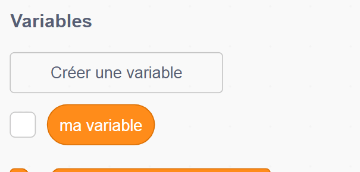
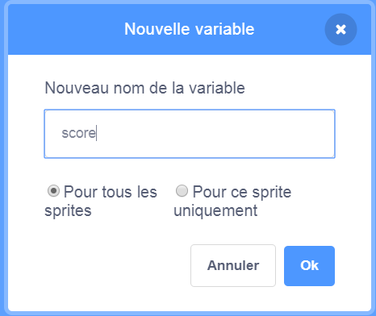
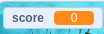

## Garder le score

Pour garder le score du nombre de poissons capturés par le joueur, tu as besoin d'un emplacement pour stocker le score, un moyen de l'ajouter et un moyen de le réinitialiser au redémarrage de la partie.

Premièrement: enregistrer le score!

\--- task \--- Vas dans la catégorie du bloc **Variables** et clique sur **Créer une Variable**.



Entre `score` comme nom.



Vérifie ta nouvelle variable!

 \--- /task \---

## \--- collapse \---

## title: Que sont les variables?

Lorsque tu souhaites stocker des informations dans un programme, tu utilises quelque chose appelé **variable**. Penses-y comme à une boîte avec une étiquette: tu peux y insérer quelque chose, vérifier son contenu et en changer le contenu. Tu trouveras des variables dans la section **Variables** , mais tu dois d'abord les créer pour les afficher!

\--- /collapse \---

Maintenant, tu dois mettre à jour la variable chaque fois que le requin mange un poisson et le réinitialiser au redémarrage du jeu. Faire les deux est assez facile:

\--- task \--- Dans la section **Variables** , prend le `définir [ma variable v] à [0]`{:class="block3variables"} et `changez les bloc [ma variable v] par [1]`{:class ="block3variables"}. Clique sur les petites flèches dans les blocs, choisis `score` dans la liste, puis insére les blocs dans ton programme:

### Code pour le requin

```blocks3
    lorsque le drapeau vert est cliqué 
+ définir [score v] sur [0]
    définir le style de rotation [gauche-droite v]
    passer à x: (0) y: (0)
```

### Code pour le poisson

```blocks3
    si <touching [Sprite1 v] ?> alors
+ changer [score v] par [1]
        masquer
        attendre (1) secondes
        aller à x: (choisir au hasard (-240) à (240)) y: (choisir au hasard (-180) à (180) )
        montrer
    fin
```

\--- /task \---

Cool! Maintenant, tu as un score et tout.