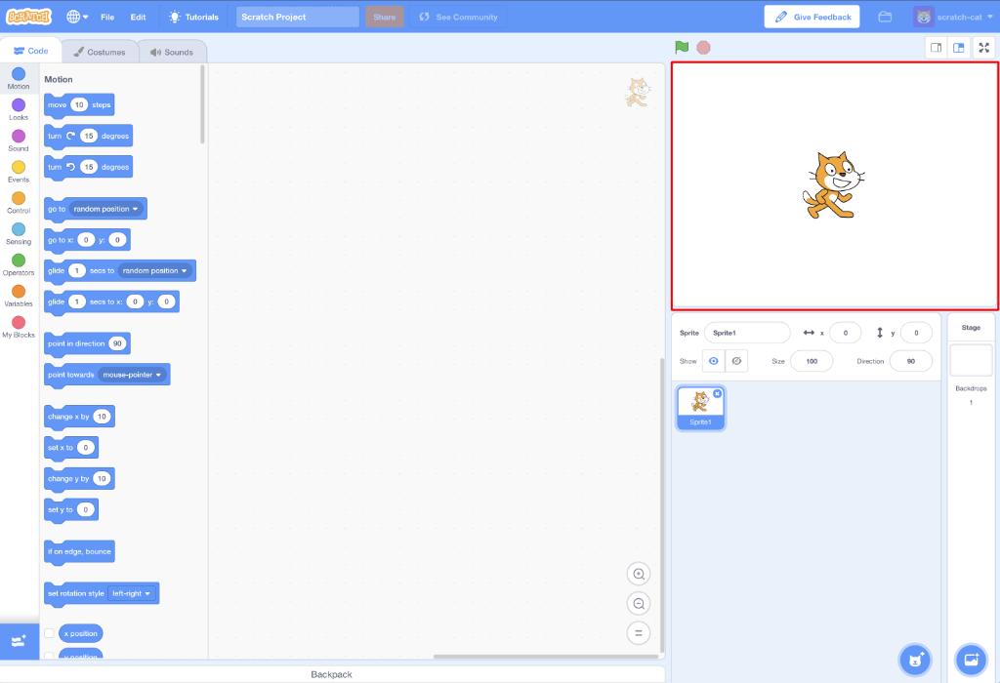

## शुरू करने के लिए

एक बार जब आप Scratch खोलते हैं, तो आपको नीचे की तरह एक विंडो दिखाई देगी।

\--- task \---

निम्नलिखित क्षेत्रों में से प्रत्येक के लिए देखें और याद रखें कि वे कहाँ हैं।

\--- /task \---

### स्टेज



## \--- collapse \---

## title: स्टेज (Stage) क्या है?

यहीं पर आपके Scratch प्रोग्राम चलते हैं। इसमें यह है:

* एक या अधिक **backgrounds** \(स्क्रीन की पृष्ठभूमि पर चित्र\)

* इससे संबंधित कोई भी **कोड ब्लॉक्स** (हम इसके बारेमें निचे चर्चा करेंगे)

\--- /collapse \---

### स्प्राइट की सूची


## \--- collapse \---

## title: स्प्राइट(sprite) क्या है?

कोई भी आइटम जिसे आप स्टेज पर जोड़ सकते हैं वह **sprite** है।

एक स्प्राइट(Sprite) में निम्न शामिल हैं:

* स्टेज पर **छवि**
* उसके किसी भी अतिरिक्त **costumes (पोशाक)** \(looks\)
* इससे जुड़ी कोई भी **sounds (आवाज़)**
* इससे जुड़ा कोई भी **कोड ब्लॉक** 

\--- /collapse \---

### कोड ब्लॉक्स की जगह


## \--- collapse \---

## title: कोड ब्लॉक्स

Scratch में कोड उन ब्लॉकों के रूप में आता है जिन्हें आप जोड़कर प्रोग्राम बना सकते हैं। आप **कोड ब्लॉक्स की जगह** से ब्लॉक्स चुनते है, उन्हें **वर्तमान स्प्राइट पैनल** में खींचते हैं, और फिर उन्हें एक दूसरे से जोड़ते हैं।

ब्लॉक की दस श्रेणियां हैं। वे रंग से दर्शाए हैं, और आप **कोड ब्लॉक्स** के ऊपर दिए आइटम के सूची में से क्लिक करके उनके बीच चयन कर सकते हैं।

\--- /collapse \---

### वर्तमान स्प्राइट पैनल


## \--- collapse \---

## title: वर्तमान स्प्राइट क्या है?

**वर्तमान स्प्राइट** वह है जिसे **स्प्राइट सूची** में से चुना गया है।

**वर्तमान स्प्राइट पैनल** वह स्थान है जहाँ आप चुनें गए स्प्राइट के कोड, वेशभूषा और ध्वनियाँ देख सकते हैं।

\--- /collapse \---

कोडिंग करने का समय!

\--- task \---

स्प्राइट सूची में, Scratch बिल्ली (Scratch Cat) पर क्लिक करें। बिल्ली अब वर्तमान स्प्राइट है।

कोड ब्लॉक्स में **Events** श्रेणी में, `when flag clicked`{:class="block3events"} ब्लॉक पर क्लिक करें, और इसे वर्तमान स्प्राइट पैनल में खींचें।

```blocks3
    when green flag clicked
```

\--- /task \---

\--- task \---

फिर कोड ब्लॉक्स में **Looks** श्रेणी पर जाएं और इस ब्लॉक को खोजें:

```blocks3
    say [Hello!] for (2) secs
```

उस पर क्लिक करें, माउस बटन को दबाए रखें, और फिर इसे वर्तमान स्प्राइट पैनल में खींचें और दबाए बटन को छोड़ दें।

\--- /task \---

\--- task \---

अब दूसरा ब्लॉक वर्तमान स्प्राइट पैनल में है, इसे पहले ब्लॉक के नीचे से जोड़कर क्लिक करें और फिर से खींचकर दूसरे ब्लॉक के नीचे ले जाकर जोड़ दें ताकि वह इस तरह दिखें:


\--- /task \---

\--- task \---

Now click the **Green Flag** to start your program and watch what happens!

\--- /task \---