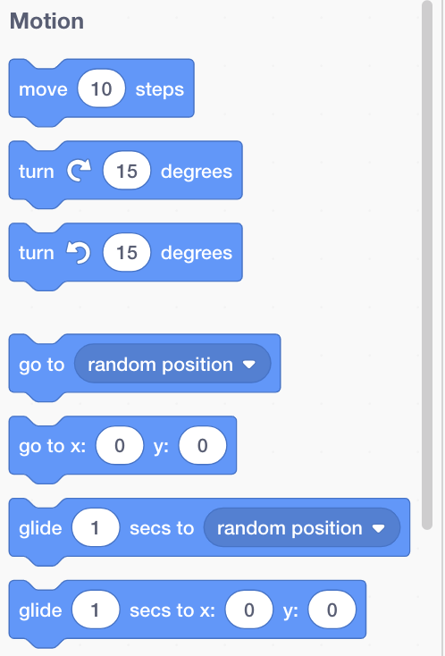

## कोड ब्लॉक जोड़ना और निकालना

शानदार! आपने अपना पहला स्क्रैच प्रोग्राम लिखा है। स्क्रैच में और बाहर कोड प्राप्त करने के बारे में थोड़ा और जानने का समय! स्क्रैच कोड **blocks** तरह की:


आपको सभी ब्लॉक **code blocks palette** उनके अनुसार विभिन्न श्रेणियों में क्रमबद्ध।

## \--- collapse \---

## शीर्षक: विभिन्न श्रेणियों से ब्लॉक का उपयोग करना

उस श्रेणी के ब्लॉक देखने के लिए श्रेणी नाम पर क्लिक करें। यहाँ, ** Motion** श्रेणी चयनित है:


आपके द्वारा क्लिक की गई श्रेणी के सभी ब्लॉक सूची में दिखाए गए हैं:



आप इच्छित ब्लाकोक पर क्लिक कर सकते हैं, और फिर इसे वर्तमान स्प्राइट पैनल में खींच सकते हैं और जाने दे सकते हैं। एक बार जब यह पैनल में होता है, तो आप इसे चारों ओर ले जा सकते हैं और इसे अन्य ब्लॉकों से जोड़ सकते हैं।

\--- /collapse \---

यदि आप देखना चाहते हैं कि ब्लॉक क्या करता है, तो आप इसे चलाने के लिए उस पर डबल-क्लिक कर सकते हैं!

\--- task \---

कुछ ब्लॉकों पर डबल क्लिक करके देखें कि वे क्या करते हैं।

\--- /task \---

## \--- collapse \---

## शीर्षक: कोड चलाना

आमतौर पर, आप चाहते हैं कि आपका कोड स्वचालित रूप से चले जब भी कुछ विशिष्ट होता है। यही कारण है कि आपके कई कार्यक्रम ** Events** के ब्लॉक से शुरू होंगे, सबसे अधिक बार यह:

```blocks3
    when green flag clicked
```

इस ब्लॉक से जुड़े कोड ब्लॉक **green flag** क्लिक किया है।

कोड ब्लॉक ऊपर से नीचे तक चलते हैं, इसलिए जिस क्रम में आप अपने ब्लॉक को एक साथ रखते हैं वह मायने रखता है। इस उदाहरण में, स्प्राइट पहले ` say` {= class = "block3looks"} `Hello` इससे कि यह `play`{:class="block3sound"} the `meow` ध्वनि।

```blocks3
    when green flag clicked
    say [Hello]
    play sound [meow v]
```

\--- /collapse \---

कोड ब्लॉक को हटाना या हटाना जो आप अपने प्रोग्राम में नहीं चाहते हैं, आसान है! बस उन्हें कोड ब्लॉक पैलेट में वापस खींचें।

**Be careful: ** कोड ब्लॉक में उन्हें खींचने से आपके द्वारा खींचे जाने वाले ब्लॉक से जुड़े सभी ब्लॉक हट जाएंगे, इसलिए उन कोड ब्लॉक को अलग करना सुनिश्चित करें जिन्हें आप हटाना चाहते हैं। यदि आप दुर्घटना से कुछ कोड ब्लॉक हटाते हैं और उन्हें वापस लाना चाहते हैं, तो राइट-क्लिक करें और फिर **undo** सब कुछ वापस पाने का विकल्प।


\--- task \---

कुछ कोड ब्लॉक जोड़ने, हटाने और हटाने का प्रयास करें!

\--- /task \---

### इस सब को एक जगह लाना

अब आप जानते हैं कि कोड को कैसे घुमाया जाए और चीजों को कैसे बनाया जाए, यह आपके लिए एक सर्कल में स्क्रैच कैट वॉक करने का प्रोग्राम बनाने का समय है!

\--- task \---

सुनिश्चित करें कि आपके पास स्प्राइट सूची में चयनित बिल्ली स्प्राइट है, और फिर स्प्राइट पैनल में निम्नलिखित ब्लॉकों को खींचें और उन्हें कनेक्ट करें। आप उन्हें **Events** और **Motion** सूचियों ईवेंट में खोजेंगे ।

```blocks3
    when green flag clicked
    move [10] steps
```

\--- /task \---

\--- task \---

अब, स्टेज के ऊपर हरे झंडे पर क्लिक करें।


\--- /task \---

आपको बिल्ली को एक सीधी रेखा में चलते हुए देखना चाहिए ... ठीक वही नहीं जो आप चाहते हैं, है ना?

नोट: यदि आप कई बार ध्वज पर क्लिक करते हैं और बिल्ली दूर चली जाती है, तो आप उसे वापस खींच सकते हैं!

\--- task \---

एक सर्कल में बिल्ली को स्प्राइट चलने के लिए मोड़ ब्लॉक को अंत तक स्नैप करें। यह **Motion** सूची में है।

```blocks3
    when green flag clicked
    move [10] steps
+    turn cw (15) degrees
```

\--- /task \---

## \--- collapse \---

## शीर्षक: यह कैसे काम करता है?

यह ब्लॉक पूर्ण 360 डिग्री वाले स्प्राइट टर्न को 15 डिग्री बनाता है जो एक सर्कल बनाता है। नंबर पर क्लिक करके और नए मूल्य में टाइप करके आप उस नंबर और चरणों की संख्या को बदल सकते हैं।


\--- /collapse \---

\--- task \---

अब अपना काम बचाओ!

\--- /task \---