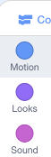

## कोड ब्लॉक जोड़ना और निकालना

शानदार! आपने अपना पहला Scratch प्रोग्राम लिखा है। समय आ गया है जब आप Scratch में कोड के बारे में अधिक जानकारी प्राप्त करें। Scratch कोड **blocks** से बना होता है जैसे की:


आपको सभी ब्लॉक, **कोड ब्लॉक्स** में उनके अनुसार विभिन्न श्रेणियों में दिखाई देंगे।

## \--- collapse \---

## title: विभिन्न श्रेणियों से ब्लॉक का उपयोग करना

उस श्रेणी के ब्लॉक देखने के लिए श्रेणी नाम पर क्लिक करें। यहाँ, ** Motion** श्रेणी को चुना गया है:



आपके द्वारा क्लिक की गई श्रेणी के सभी ब्लॉक सूची में दिखाए गए हैं:


आप इच्छित ब्लॉक को क्लिक कर सकते हैं, और फिर इसे वर्तमान स्प्राइट पैनल में खींचकर जाने दे सकते हैं। एक बार जब यह पैनल में होता है, तो आप इसे चारों ओर ले जा सकते हैं और इसे अन्य ब्लॉकों से जोड़ सकते हैं।

\--- /collapse \---

यदि आप देखना चाहते हैं कि ब्लॉक क्या करता है, तो आप इसे चलाने के लिए उस पर डबल-क्लिक कर सकते हैं!

\--- task \---

कुछ ब्लॉकों पर डबल क्लिक करके देखें कि वे क्या करते हैं।

\--- /task \---

## \--- collapse \---

## title: कोड चलाना

आमतौर पर, आप चाहते हैं कि जब भी कुछ विशिष्ट हो, तो आपका कोड अपने आप चले। यही कारण है कि आपके कई कार्यक्रम **Events** श्रेणी के ब्लॉक से शुरू होते हैं, सबसे अधिक बार यह:

```blocks3
    when green flag clicked
```

इस ब्लॉक से जुड़े कोड ब्लॉक **green flag** पर क्लिक करने पर चलते है।

कोड ब्लॉक ऊपर से नीचे तक चलते हैं, इसलिए जिस क्रम में आप अपने ब्लॉक को एक साथ रखते हैं वह मायने रखता है। इस उदाहरण में, स्प्राइट पहले `say`{:class="block3looks"} `Hello` इससे पहले कि यह `play`{:class="block3sound"} करें `meow` ध्वनि।

```blocks3
    when green flag clicked
    say [Hello]
    play sound [meow v]
```

\--- /collapse \---

कोड ब्लॉक को हटाना या निकालना जो आप अपने प्रोग्राम में नहीं चाहते हैं, आसान है! बस उन्हें कोड ब्लॉक पैलेट में वापस खींचें।

**सावधान रहें:** कोड ब्लॉक में उन्हें खींचने से आपके द्वारा खींचे जाने वाले ब्लॉक से जुड़े सभी ब्लॉक हट जाएंगे, इसलिए सुनिश्चित करें की आप उन कोड ब्लॉक को अलग करें जिन्हें आप हटाना चाहते हैं। यदि आप दुर्घटना से कुछ कोड ब्लॉक हटाते हैं और उन्हें वापस लाना चाहते हैं, तो राइट-क्लिक करें और फिर **undo** विकल्प पर दबाकर आप उसे वापस पा सकते हैं।


\--- task \---

कुछ कोड ब्लॉक जोड़ने, हटाने और निकालने का प्रयास करें!

\--- /task \---

### इस सब को एक जगह लाना

अब आप जानते हैं कि कोड को कैसे घुमाया जाए और चीजों को कैसे बनाया जाए, अब आप एक ऎसा प्रोग्राम बनाए जिससे आप Scratch बिल्ली को एक गोल में चलाएं!

\--- task \---

सुनिश्चित करें कि आपने स्प्राइट सूची में से बिल्ली स्प्राइट को चुना है, और फिर स्प्राइट पैनल में निम्नलिखित ब्लॉकों को खींचें और उन्हें जोड़ें। आप उन्हें **Events** और **Motion** सूचियों में खोज सकते हैं।

```blocks3
    when green flag clicked
    move [10] steps
```

\--- /task \---

\--- task \---

अब, स्टेज के ऊपर के हरे झंडे पर क्लिक करें।


\--- /task \---

आप बिल्ली को एक सीधी रेखा में चलते हुए देख सकते हैं... यह वह नहीं है जो आप चाहते हैं, है ना?

सूचना: यदि आप कई बार ध्वज पर क्लिक करते हैं और बिल्ली दूर चली जाती है, तो आप उसे वापस खींच सकते हैं!

\--- task \---

एक गोल में बिल्ली स्प्राइट को चलाने के लिए turn ब्लॉक को अंत में जोड़ें। यह **Motion** सूची में भी है।

```blocks3
    when green flag clicked
    move [10] steps
+    turn cw (15) degrees
```

\--- /task \---

## \--- collapse \---

## title: घूमना(turning) कैसे काम करता है?

यह ब्लॉक स्प्राइट को 15 डिग्री से घुमाता है जो एक गोल का पूरा 360 डिग्री बनाता। आप इस अंक पर क्लिक करके, उस अंक और चरणों के अंकों को बदलकर आप नए अंको को टाइप कर सकते हैं।


\--- /collapse \---

\--- task \---

अब अपना काम को सहेजे (save)!

\--- /task \---