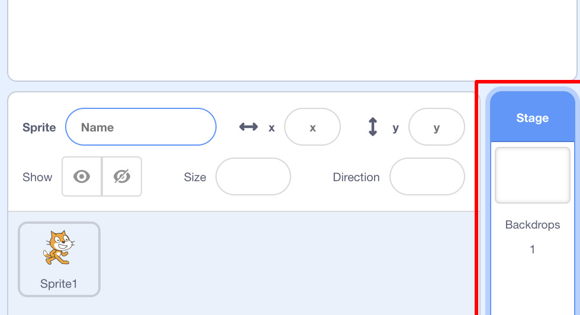

## दृश्य की स्थापना

स्क्रैच में पृष्ठभूमि का एक पुस्तकालय होता है और आपके प्रोजेक्ट को कमाल दिखाने के लिए आपको इसका उपयोग करने के लिए स्प्राइट करता है।

\--- task \---

स्टेज का चयन करें।

** Backdrops ** पर क्लिक करें।

**Choose backdrop from library पर क्लिक करें ** आइकन चुनें ।

फिर अपनी पसंदीदा पानी के नीचे की पृष्ठभूमि चुनें!

\--- /task \---

शानदार! बेशक, अब आपके पास एक बिल्ली पानी के नीचे है, और बिल्लियों आमतौर पर उस के बड़े प्रशंसक नहीं हैं। लेकिन आप इसे ठीक कर सकते हैं, क्योंकि आप बिल्ली को शार्क में बदल सकते हैं!

\--- task \---

अपने अनतरिक्ष-यान स्प्राइट पर क्लिक करें, और **Costumes** टैब पर क्लिक करें।

फिर, **Choose costume from Library** पर क्लिक करें

इस शार्क छवि का चयन करें और **OK** क्लिक करें।

अब उनमें से प्रत्येक का चयन करके और ** x** पर क्लिक करके बिल्ली की वेशभूषा को हटा दें ।

\--- /task \---

अब आपके पास एक शार्क है - उत्कृष्ट!