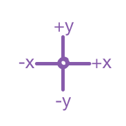

## चीजों को इधर-उधर करना

अभी आपका शार्क एक गोल में चलता है, और इसे तीर कुंजियों के साथ नियंत्रित करने में बहुत अधिक मज़ा आएगा। इस बार, आप सीखेंगे कि यह कैसे करना है!

\--- task \---

शार्क के लिए आपके पास मौजूद सभी कोड को हटाकर प्रारंभ करें।

\--- /task \---

जैसा कि आपने शायद अनुमान लगाया होगा, आपको **Event** और **Motion** ब्लॉक्स की फिर से आवश्यकता होगी!

\--- task \---

इस बार, इस ब्लॉक को देखें और इसे वर्तमान स्प्राइट पैनल में खींचें:

```blocks3
    when [space v] key pressed
```

`space` कुंजी के पास स्थित छोटे तीर (▼) पर क्लिक करें। आपको अपने सभी कीबोर्ड कुंजियों की एक सूची दिखाई देगी, उसमें से आप एक कुंजी को चुन सकते हैं।

\--- /task \---

आपको `when key pressed`{:class="block3events"} के चार ब्लॉक लगेंगे - आपके प्रत्येक तीर कुंजी के लिए एक।

\--- task \---

अपने शार्क को हिलाने के लिए, इन ब्लॉक्स को **Motion** ब्लॉक्स के साथ इस तरह से जोड़े:

```blocks3
    when [left arrow v] key pressed
    move (-10) steps
```

```blocks3
    when [right arrow v] key pressed
    move (10) steps
```

```blocks3
    when [up arrow v] key pressed
```

```blocks3
    when [down arrow v] key pressed
```

\--- /task \---

**ध्यान दें**: ` -10 ` का मतलब 'go back 10 steps' है।

\--- task \---

**Test:** Press the left arrow key and right arrow key multiple times to test your code.

\--- /task \---

अब आपका शार्क आगे और पीछे चलता है, जो बहुत अच्छा है, लेकिन यह ऊपर या नीचे नहीं जाता है। इसके अलावा, यदि आप **Motion** ब्लॉक के माध्यम से देखते हैं, आप देखेंगे कि 'ऊपर' या 'नीचे' के लिए कोई ब्लॉक नहीं हैं। हालांकि उनमें से एक पूरा गुच्छा **x** और **y** निर्देशांक से संबंधित है - चलो उन से कोशिश करें!

\--- task \---

दो `change y by`{:class="block3motion"} ब्लॉक्स को उठाएं, और अपने कोड को इस तरह से अपडेट कीजिए:

```blocks3
    when [up arrow v] key pressed
+     change y by (10)
```

```blocks3
    when [down arrow v] key pressed
+     change y by (-10)
```

\--- /task \---

अब जब आप तीर कुंजी दबाते हैं, तो शार्क मंच के चारों ओर घूमती है!

## \--- collapse \---

## title: x- और y- निर्देशांक कैसे काम करते हैं?

वस्तुओं की स्थिति के बारे में बात करने के लिए, जैसे स्प्राइट, हम अक्सर x- और y- निर्देशांक का उपयोग करते हैं। स्टेज निर्देशांक का **x-axis** प्रणाली **बाएं से दाएं**, और **y-axis** **नीचे से ऊपर** तक चलते हैं।



एक स्प्राइट को उसके केंद्र के निर्देशांक द्वारा स्थित कर सकते है, उदाहरण के लिए `(15, -27)`, जहां `15` x-axis के साथ इसका स्थान है, और `-27` y-axis के साथ इसका स्थान है।

+ यह वास्तव में कैसे काम करता है, इसके बारे में महसूस करने के लिए, स्प्राइट को चुनें और **x** और **y** का उपयोग करें निर्देशांक के लिए अलग-अलग मान सेट करके इसे स्टेज के चारों ओर ले जाने के लिए नियंत्रित करें।


+ मूल्यों के विभिन्न जोड़े आजमा कर यह देखने की कोशिश करें कि स्प्राइट कहां जाता है! Scratch में x-axis `-240` से `240` तक जाता है, और y-axis `-180` से `180` तक जाता है।

\--- /collapse \---

### खेल को फिर से शुरू करना

शार्क अब पूरे स्क्रीन पर घूम सकता है, लेकिन कल्पना करें कि यह एक गेम है: आप इसे कैसे पुनः आरंभ करते हैं, और प्रत्येक गेम की शुरुआत में क्या होता है?

खिलाड़ी को खेल शुरू करने पर आपको शार्क को उसके मूल स्थान पर लाने की आवश्यकता होती है। वे हरे झंडे पर क्लिक करके इस खेल को शुरू करेंगे, इसलिए जब आप ऐसा करते हैं तो आपको शार्क स्प्राइट के x-axis और y-axis निर्देशांक को बदलना होगा।

यह वास्तव में बहुत आसान है! स्टेज का केंद्र <0 >(x, y)</code> निर्देशांक में `(0, 0)` हैं।

तो आपकी जरूरत है उस हरे झंडे के लिए **Event** ब्लॉक की, और **Motion** से **go to**ब्लॉक की।

\--- task \---

`when green flag clicked`{:class="block3events"} ब्लॉक को **Event** श्रेणी से वर्तमान स्प्राइट पैनल में खिचिएं।

```blocks3
    when green flag clicked
```

फिर `go to`{:class="block3motion"} ब्लॉक को **Motion** श्रेणी में खोजें, और इसे अपने ध्वज के **Event** ब्लॉक में जोड़ें।

```blocks3
    when green flag clicked
+     go to x: (0) y: (0)
```

`x` और `y`, दोनों निर्देशांक को `go to`{:class="block3motion"} ब्लॉक में `0` पर सेट करें अगर वे पहले से `0` पर नहीं है तोह।

\--- /task \---

\--- task \---

अब हरे झंडे पर क्लिक करें: आपको शार्क स्टेज के केंद्र में वापस दिखनी चाहिए!

\--- /task \---