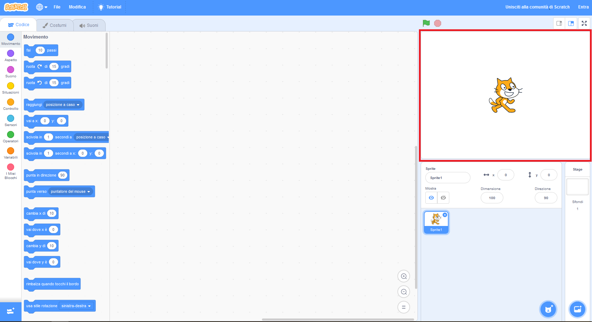
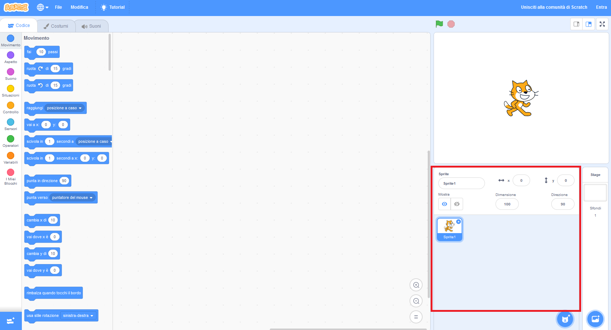
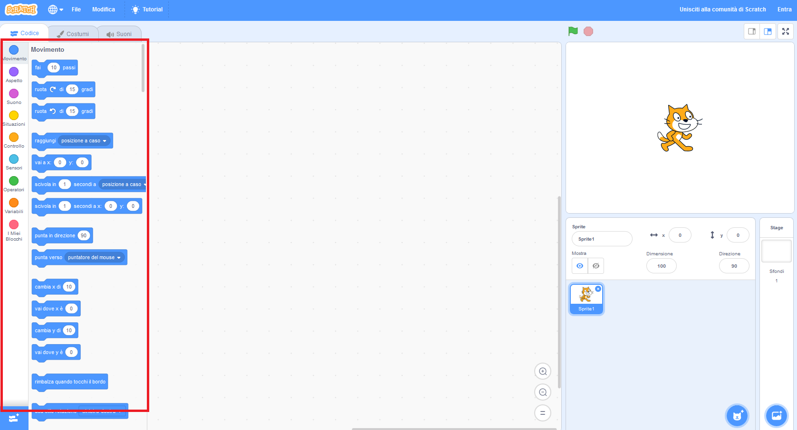
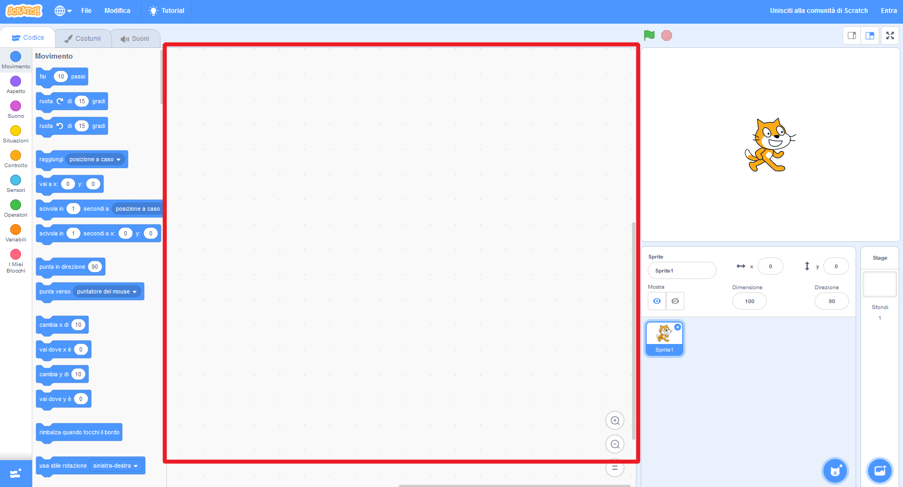
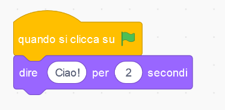

## Prepararsi

Una volta aperto Scratch, vedrai una finestra come quella qui sotto.

\--- task \---

Cerca ognuna delle seguenti aree e ricorda dove si trovano.

\--- /task \---

### Lo Stage



## \--- collapse \---

## title: qual è il palcoscenico?

Qui è dove vengono eseguiti i tuoi programmi Scratch. Esso ha:

* Uno o più **sfondi** \ (immagini sullo sfondo dello schermo \)

* Qualsiasi **blocchi di codice** associati ad esso \ (ci arriveremo a questo \)

\--- /collapse \---

### La lista degli sprite



## \--- collapse \---

## title: Cos'è uno sprite?

Qualsiasi elemento che puoi aggiungere sullo stage è uno **sprite**.

Uno sprite include:

* L' **immagine** sullo stage
* Ogni **costume in più** \ (sembra \) avere
* Qualsiasi **suoni** associato ad esso
* Qualsiasi **blocchi di codice** associati ad esso 

\--- /collapse \---

### La tavolozza dei blocchi di codice



## \--- collapse \---

## title: blocchi di codice

Il codice in Scratch si presenta sotto forma di blocchi che si connettono per creare programmi. Potete scegliere i blocchi dalla tavolozza dei **blocchi di codice **, trascinarli nel **pannello sprite corrente**, e quindi collegarli tra loro.

Esistono dieci categorie di blocchi. Sono codificati dai colori e puoi scegliere tra loro cliccando sugli elementi nella lista nella parte superiore della **tabella blocchi di codice**.

\--- /collapse \---

### Il pannello dello sprite corrente



## \--- collapse \---

## title: qual è lo sprite corrente?

Lo **sprite corrente** è quello selezionato nella **lista sprite**.

Il pannello **dello sprite corrente** è dove puoi vedere il codice, i costumi e i suoni per lo sprite selezionato.

\--- /collapse \---

È tempo di programmare!

\--- task \---

Nell'elenco sprite, clicca sul gatto Scratch. Il gatto è ora lo sprite attuale.

Scegli la categoria **Eventi** nella tavolozza dei blocchi di codice, clicca il blocco `quando si clicca sulla bandiera verde`{:class="block3events"} e trascinalo nel pannello dello sprite corrente.

```blocks3
    when green flag clicked
```

\--- /task \---

\--- task \---

Quindi scegli **Aspetto** nella tavolozza dei blocchi di codice e cerca questo blocco:

```blocks3
    dire [Ciao!] per (2) secondi
```

Cliccalo, tienilo premuto con il pulsante del mouse, trascinalo nel pannello Sprite corrente e rilascia il pulsante.

\--- /task \---

\--- task \---

Ora che il secondo blocco si trova nel pannello sprite corrente, collegalo alla parte inferiore del primo blocco cliccando e trascinando di nuovo per spostarlo sotto l'altro blocco fino a quando non si agganciano insieme, in questo modo:



\--- /task \---

\--- task \---

Ora fai clic sul pulsante **Avvia programma** e guarda cosa succede!

\--- /task \---